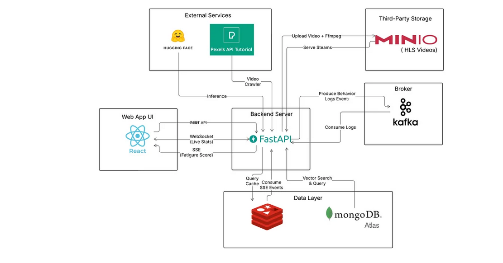

# 🌿 GoTouchGrass — Wellbeing-Aware AI Video Feed

> **MongoDB AI Hackathon 2026** — A mindful short-form video platform that detects doomscrolling in real-time and autonomously rebalances your feed with calming content using MongoDB Atlas Vector Search.

<p align="center">
  
  
  
  
  
</p>

---

## 📋 Table of Contents

- [Problem Statement](#-problem-statement)
- [Solution Overview](#-solution-overview)
- [System Architecture](#-system-architecture)
- [Tech Stack](#-tech-stack)
- [🧠 Core Algorithm — Formula Engine (Backend)](#-core-algorithm--formula-engine-backend)
  - [Fatigue Score Formula](#1-fatigue-score-formula)
  - [Trending Score Formula](#2-trending-score-formula)
  - [Interest Vector — EMA Update](#3-interest-vector--ema-update)
- [⚡ Frontend Architecture Highlights](#-frontend-architecture-highlights)
  - [Accumulate Algorithm — Infinite Scroll Without Data Loss](#1-accumulate-algorithm--infinite-scroll-without-data-loss)
  - [🎬 Sliding Video Virtualization — `<video>` → `<div>` Memory Optimization](#2--sliding-video-virtualization--video--div-memory-optimization)
- [Real-time Communication](#-real-time-communication)
- [Project Structure](#-project-structure)
- [Getting Started](#-getting-started)
- [Deployment](#-deployment)
- [Team](#-team)

---

## 🎯 Problem Statement

Short-form video platforms are designed to maximize engagement — but not user wellbeing. **Doomscrolling** leads to mental fatigue, anxiety, and wasted time. Users often don't realize they're stuck in an infinite loop of stimulating content.

## 💡 Solution Overview

**GoTouchGrass** is a TikTok-like video feed that:

1. **Monitors** user behavior in real-time (watch duration, swipe speed, interaction patterns)
2. **Calculates** a **Fatigue Score** (0–100%) using a multi-signal penalty engine
3. **Autonomously reranks** the feed when fatigue rises — injecting calming, nature, and educational content via **MongoDB Atlas Vector Search**
4. **Intervenes** with a 2-stage "Touch Grass" modal system when fatigue reaches critical levels

---

## 🏗 System Architecture



---

## 🛠 Tech Stack

| Layer          | Technology                          | Purpose                                              |
| -------------- | ----------------------------------- | ---------------------------------------------------- |
| **Frontend**   | React 19 + TypeScript + Vite        | Snap-scroll video feed UI                            |
| **Styling**    | Tailwind CSS 4                      | Responsive mobile-first design                       |
| **State Mgmt** | SWR + React Hooks                   | Data fetching, caching, pagination                   |
| **Video**      | HLS.js                              | Adaptive bitrate streaming (HLS/MP4)                 |
| **Backend**    | FastAPI 0.115 + Uvicorn             | Async Python API server                              |
| **Database**   | MongoDB Atlas                       | Document store + Vector Search ($vectorSearch)        |
| **Streaming**  | Apache Kafka (KRaft)                | Behavior log ingestion buffer (anti-bottleneck)      |
| **Cache**      | Redis                               | Session seen-set dedup + Celery broker               |
| **Storage**    | MinIO (S3-compatible)               | Self-hosted video/media storage                      |
| **Workers**    | Celery                              | Async video processing tasks                         |
| **Monitoring** | Prometheus + Grafana                | System metrics & dashboards                          |
| **Real-time**  | SSE (Server-Sent Events) + WebSocket| Fatigue push + live video stats                      |

---

## 🧠 Core Algorithm — Formula Engine (Backend)

> **Location**: [`backend/app/utils/formula/`](backend/app/utils/formula/)
>
> The Formula Engine is the **single source of truth** for all algorithmic constants and pure computation. Services only orchestrate I/O — all math lives here.

### 1. Fatigue Score Formula

> **File**: [`fatigue.py`](backend/app/utils/formula/fatigue.py)

The Fatigue Score is a composite metric (0–100%) that quantifies how "burnt out" a user is during a session. It uses a **multi-signal penalty system**:

```
Fatigue = avg(log_penalties) + dopamine_penalty + volume_penalty
```

#### Signal Breakdown:

| Signal                | Condition              | Penalty     | Rationale                           |
| --------------------- | ---------------------- | ----------- | ----------------------------------- |
| **Watch Duration**    | < 2s                   | 30 pts      | Doom-scrolling signal               |
|                       | < 5s                   | 15 pts      | Quick skip                          |
|                       | < 15s                  | 5 pts       | Short watch                         |
|                       | ≥ 15s                  | 0 pts       | Healthy engagement                  |
| **Swipe Speed**       | > 800 px/s             | 20 pts      | Frantic scrolling                   |
|                       | > 400 px/s             | 10 pts      | Fast scrolling                      |
| **Passive Scroll**    | No interaction (like/comment) | 15 pts | Zombie scrolling              |
| **Consecutive Topic** | ≥ 5 same topic         | 25 pts      | Content tunnel vision               |
|                       | ≥ 3 same topic         | 15 pts      | Repetitive pattern                  |
| **Dopamine Ratio**    | high_intensity / total | × 10.0      | Too much stimulating content        |
| **Volume Penalty**    | Per video watched      | × 0.5       | Session fatigue accumulation        |

#### Adaptive State Machine:

```
Score < 40   → "normal"     ✅  (Feed: normal ranking)
Score ≤ 70   → "warning"    ⚠️  (Feed: begin calming injection)
Score ≤ 80   → "exhausted"  🔥  (Feed: aggressive rerank to calming content)
Score > 80   → "critical"   💀  (Trigger Touch Grass modal)
```

### 2. Trending Score Formula

> **File**: [`trending.py`](backend/app/utils/formula/trending.py)

Combines interaction weights with **exponential time-decay** per category:

```
raw_score = views × 1 + likes × 3 + comments × 5
effective_score = raw_score × e^(-λt)
```

Where `λ = ln(2) / half_life` and half-life varies by category:

| Category      | Half-life  | Rationale                          |
| ------------- | ---------- | ---------------------------------- |
| Entertainment | 7 days     | Fast-churning content              |
| Sports        | 5 days     | Event-driven, very time-sensitive  |
| Education     | 30 days    | Evergreen value                    |
| Nature/Calming| 30 days    | Timeless wellbeing content         |
| Lifestyle     | 14 days    | Medium shelf-life                  |

The trending module also provides **MongoDB aggregation pipeline builders** (`$addFields`, `$set`) that compute trending scores **server-side** inside the database — avoiding round-trips.

### 3. Interest Vector — EMA Update

> **File**: [`interest_vector.py`](backend/app/utils/formula/interest_vector.py)

User preference tracking via **Exponential Moving Average (EMA)** on embedding vectors:

```
new_vec = α × current_vec + (1 - α) × weight × video_embedding
→ L2-normalize for cosine similarity in $vectorSearch
```

| Parameter           | Value   | Meaning                                  |
| ------------------- | ------- | ---------------------------------------- |
| `α` (momentum)      | 0.85    | Keep 85% old preferences, blend 15% new  |
| `like` weight       | +1.0    | Strong positive signal                   |
| `replay` weight     | +0.8    | Rewatched — strong interest              |
| `comment` weight    | +0.6    | Active engagement                        |
| `share` weight      | +0.5    | Positive but weaker signal               |
| `passive_view`      | +0.2    | Watched but didn't interact              |
| `skip` weight       | −0.3    | Negative signal — push vector away       |

The normalized vector is used with **MongoDB Atlas `$vectorSearch`** to find semantically similar videos for personalized feed ranking.

---

## ⚡ Frontend Architecture Highlights

### 1. Accumulate Algorithm — Infinite Scroll Without Data Loss

> **File**: [`App.tsx`](frontend/src/App.tsx) — `accumulatedVideos` state

The frontend uses an **Accumulate pattern** to implement infinite scroll without losing previously loaded videos. This is critical because the feed is a snap-scroll list — the user can scroll back up to revisit earlier videos.

#### How It Works:

```tsx
// State: grows monotonically as new batches arrive
const [accumulatedVideos, setAccumulatedVideos] = useState<any[]>([]);

// Each API response is APPENDED (not replaced)
useEffect(() => {
  if (currentVideos && currentVideos.length > 0) {
    setAccumulatedVideos(prev => {
      // Dedup: only append videos not already in the list
      const newVids = currentVideos.filter(cv => !prev.find(p => p.id === cv.id));
      return newVids.length > 0 ? [...prev, ...newVids] : prev;
    });
  }
}, [currentVideos]);
```

#### Key Design Decisions:

| Decision | Rationale |
| --- | --- |
| **Client-side dedup** (`filter` by `id`) | SWR may re-deliver cached results; prevents duplicate cards |
| **Server-side dedup** via Redis seen-set | Backend tracks `seen_video_ids` per session → each `mutateFeed()` returns only unseen videos |
| **`feedFetchKey` counter** | Incrementing this changes the SWR cache key, forcing a real network request even when `limit` stays constant |
| **`hasFetchedNextBatch` guard** | Prevents triggering multiple fetches when user scrolls near the boundary |
| **`hasMoreContent` flag** | Set to `false` when backend returns fewer than `BATCH_SIZE` → stops further fetches |
| **Ref mirror** (`accumulatedVideosRef`) | Allows stable reads inside `useCallback` without stale closure issues |

#### Data Flow:

```
User scrolls near end (last 2 videos)
  → Feed.onLoadMore()
    → setFeedFetchKey(prev => prev + 1)
      → SWR re-fetches with new cache key
        → Backend returns fresh batch (deduped by Redis seen-set)
          → currentVideos updates
            → useEffect APPENDS to accumulatedVideos
              → Feed receives growing array, no data loss
```

---

### 2. 🎬 Sliding Video Virtualization — `<video>` → `<div>` Memory Optimization

> **File**: [`VideoCard.tsx`](frontend/src/components/VideoCard.tsx) — Sliding Window
>
> **This is the most critical frontend optimization.** Without it, the browser accumulates GPU decoders and VRAM for every `<video>` element ever created, leading to memory exhaustion and crashes during long scroll sessions.

#### The Problem:

In an infinite-scroll video feed, each `<video>` element allocates:
- A **GPU hardware decoder** (limited to ~8–16 per browser)
- **Video texture memory** (VRAM) for decoded frames
- **Network buffer** (pre-fetched chunks)

After scrolling past 50+ videos, the browser runs out of GPU decoders → `NS_BINDING_ABORTED` errors → new videos fail to play → app becomes unresponsive.

#### The Solution — Sliding Window:

```tsx
const WINDOW_SIZE = 2;

// Only cards within ±2 of the active index get a real <video>
const isInWindow = Math.abs(index - activeIndex) <= WINDOW_SIZE;

return (
  <div className="relative w-full h-full">
    {isInWindow ? (
      // ✅ Real video element — GPU decoder allocated
      <video ref={setRefs} className="w-full h-full object-cover" ... />
    ) : (
      // ✅ Lightweight placeholder — ZERO GPU cost
      <div className="w-full h-full bg-zinc-950" aria-hidden="true" />
    )}
  </div>
);
```

#### Visualization:

```
Video Index:  0    1    2   [3]   4    5    6    7    8   ...
Element:    <div><div><vid> <vid> <vid><div><div><div><div>
                       ▲    ▲    ▲
                  WINDOW_SIZE = 2
                  (only 5 <video> elements exist at any time)
```

#### Aggressive GPU Cleanup:

When a card **exits** the window, the component doesn't just hide the video — it **forcefully releases GPU resources**:

```tsx
useEffect(() => {
  if (!isInWindow && videoRef.current) {
    const video = videoRef.current;
    video.pause();
    video.removeAttribute('src');  // Remove source
    video.load();                  // Force browser to release GPU decoder + texture cache
    video.preload = 'none';        // Prevent re-preloading
  }
}, [isInWindow]);
```

#### Why `<div>` Instead of Hidden `<video>`:

| Approach | GPU Decoders | VRAM | DOM Weight | Result |
| --- | --- | --- | --- | --- |
| `<video hidden>` | ❌ Still held | ❌ Still held | Heavy | **Memory leak** |
| `<video>` + `removeAttribute('src')` | ✅ Released | ✅ Released | Medium | OK but still heavy DOM |
| **`<div>` placeholder** | ✅ Never allocated | ✅ Zero | Minimal | **🏆 Optimal** |

> **Key insight**: By completely replacing the `<video>` element with a `<div>`, we ensure the browser **never even creates** a GPU decoder for off-screen cards. This is fundamentally different from hiding or pausing a `<video>` — the HTML element itself does not exist, so there is zero GPU/VRAM overhead. Combined with the aggressive cleanup on window exit, this guarantees constant memory usage regardless of how many videos the user scrolls through.

---

## 📡 Real-time Communication

GoTouchGrass uses a **dual real-time channel** architecture:

| Channel | Protocol | Direction | Purpose |
| --- | --- | --- | --- |
| **Fatigue Stream** | SSE (Server-Sent Events) | Server → Client | Push fatigue score & adaptive state updates |
| **Video Stats** | WebSocket (Singleton) | Bidirectional | Subscribe/unsubscribe to live like/comment counts |
| **Behavior Logs** | Kafka → Backend | Client → Server | High-frequency log ingestion (anti-bottleneck) |

### Why Kafka for Behavior Logs?

Doomscrolling generates **high-frequency behavioral data** (every swipe, every pause, every skip). Writing directly to MongoDB on every event would cause I/O bottleneck. Kafka acts as a **decoupling buffer**:

```
Frontend → REST API → Kafka Producer → Topic: behavior-logs
                                              ↓
                            Kafka Consumer (background asyncio task)
                                              ↓
                            Batch process → MongoDB (bulk write)
                                              ↓
                            Recalculate fatigue → SSE push to client
```

---

## 📁 Project Structure

```
mongodbHackathon/
├── backend/
│   ├── app/
│   │   ├── controllers/          # API route handlers (REST endpoints)
│   │   │   ├── feed_controller.py
│   │   │   ├── interaction_controller.py
│   │   │   ├── video_controller.py
│   │   │   └── auth_controller.py
│   │   ├── services/             # Business logic layer
│   │   │   ├── feed_service.py        # Vector Search + Adaptive Rerank
│   │   │   ├── interaction_service.py # Behavior logging + EMA update
│   │   │   └── video_service.py
│   │   ├── repositories/         # Data access layer (MongoDB, Redis)
│   │   ├── models/               # Pydantic schemas
│   │   ├── kafka/                # Kafka producer/consumer
│   │   ├── workers/              # Background consumers
│   │   ├── utils/
│   │   │   └── formula/          # ⭐ Core Algorithm Engine
│   │   │       ├── __init__.py        # Re-exports all formulas
│   │   │       ├── fatigue.py         # Fatigue Score computation
│   │   │       ├── trending.py        # Trending Score + time-decay
│   │   │       └── interest_vector.py # EMA vector update
│   │   ├── main.py               # FastAPI app entry point
│   │   └── config.py             # Settings (env-based)
│   ├── Dockerfile
│   ├── requirements.txt
│   └── docker-compose.yml        # Local dev (Redis, MinIO, Kafka)
│
├── frontend/
│   ├── src/
│   │   ├── components/
│   │   │   ├── Feed.tsx           # Snap-scroll container + pagination
│   │   │   ├── VideoCard.tsx      # ⭐ Sliding Video virtualization
│   │   │   ├── AnalyticsDashboard.tsx
│   │   │   ├── TouchGrassModal.tsx
│   │   │   └── FarewellScreen.tsx
│   │   ├── hooks/
│   │   │   ├── useSessionSSE.ts   # SSE fatigue stream
│   │   │   └── useVideoStats.ts   # WebSocket singleton manager
│   │   ├── api/
│   │   │   └── client.ts          # SWR hooks + REST client
│   │   ├── context/
│   │   │   └── AuthContext.tsx
│   │   └── App.tsx                # ⭐ Accumulate algorithm + state machine
│   ├── Dockerfile
│   ├── nginx.conf                 # Reverse proxy for API + WebSocket
│   └── package.json
│
├── docker-compose.prod.yml       # Full production stack (9 services)
├── deploy.sh                     # Deployment script
├── grafana/                      # Dashboard provisioning
├── prometheus/                   # Metrics scraping config
└── scripts/                      # Utility scripts
```

---

## 🚀 Getting Started

### Prerequisites

- **Node.js** ≥ 18
- **Python** ≥ 3.11
- **Docker** & **Docker Compose**
- **MongoDB Atlas** cluster (with Vector Search index)

### 1. Backend Setup

```bash
cd backend

# Create virtual environment
python -m venv venv
source venv/bin/activate

# Install dependencies
pip install -r requirements.txt

# Configure environment
cp .env.example .env
# Edit .env with your MongoDB URI, API keys, etc.

# Start infrastructure (Redis, MinIO, Kafka)
docker compose up -d

# Run the server
uvicorn app.main:app --host 0.0.0.0 --port 8033 --reload
```

### 2. Frontend Setup

```bash
cd frontend

# Install dependencies
npm install

# Start dev server
npm run dev
```

### 3. Seed Data (Optional)

```bash
cd backend
python crawl_pexels.py      # Crawl videos from Pexels API
python setup_and_run.py      # Setup MongoDB indexes + seed data
```

---

## 🐳 Deployment

Full production deployment with Docker Compose (9 services):

```bash
# Build and start all services
docker compose -f docker-compose.prod.yml up -d --build
```

Services started:
1. **Redis** — Session cache + Celery broker
2. **MinIO** — S3-compatible media storage
3. **Kafka** — Behavior log buffer (KRaft mode, no Zookeeper)
4. **Backend** — FastAPI on port 8033
5. **Celery Worker** — Async video processing
6. **Frontend** — Nginx reverse proxy on port 80
7. **Prometheus** — Metrics scraping (port 9090)
8. **Grafana** — Dashboards (port 3000)
9. **Node Exporter** — Hardware metrics

---

## 👥 Team

Built with 💚 for the **MongoDB AI Hackathon 2026**.

---

<p align="center">
  <em>"The best app is the one that knows when to tell you to stop using it." 🌿</em>
</p>
