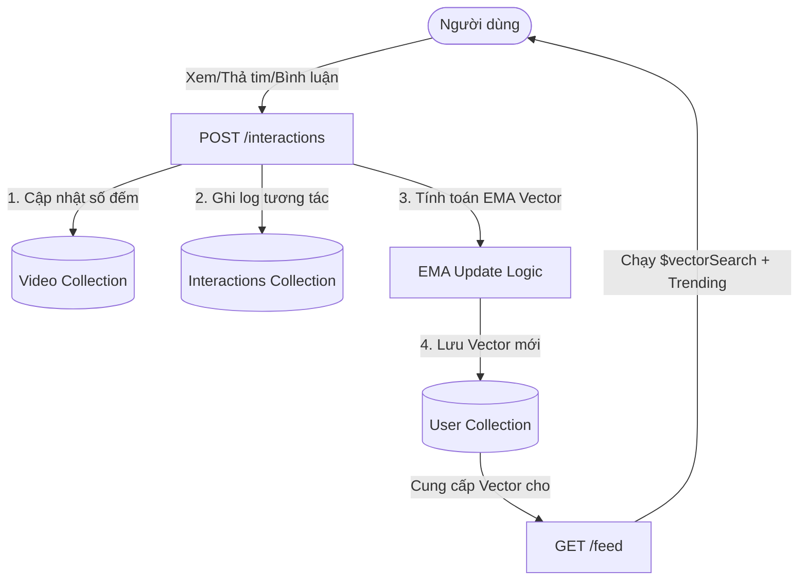

# Hướng Dẫn MongoDB Aggregation Pipeline - Personalization & Recommendation Feed

Tài liệu này mô tả chi tiết thiết kế và cách thức hoạt động của các MongoDB Aggregation Pipelines được sử dụng trong hệ thống gợi ý video (Personalization & Recommendation Feed) của dự án. Hệ thống kết hợp tìm kiếm ngữ nghĩa (Semantic Search) và mức độ thịnh hành động (Dynamic Trending Score) để tối ưu hóa trải nghiệm người dùng.

---

## 1. Công Thức Tính Điểm Trending Động (Dynamic Trending Score)

Điểm trending của một video được tính toán động tại thời điểm truy vấn (query-time) theo công thức:

$$\text{trending\_score} = (\text{view\_count} \times 1) + (\text{like\_count} \times 3) + (\text{comment\_count} \times 5)$$

### Lý do tính toán động:
- Giúp dễ dàng điều chỉnh trọng số của `view`, `like`, `comment` mà không cần chạy lại dữ liệu lịch sử hoặc cập nhật thủ công toàn bộ DB.
- Tránh việc bị lệch điểm khi các tương tác tăng trưởng liên tục.

---

## 2. Chi Tiết Các Aggregation Pipelines

### 2.1. Pipeline Cho Video Nổi Bật (Trending Feed - `find_trending`)
Pipeline này được sử dụng để lấy danh sách các video thịnh hành nhất khi người dùng mới đăng nhập (Cold-start) hoặc truy cập trang khám phá chung.

```python
pipeline = [
    {
        "$addFields": {
            "trending_score": {
                "$add": [
                    {"$multiply": [{"$ifNull": ["$view_count", 0]}, 1]},
                    {"$multiply": [{"$ifNull": ["$like_count", 0]}, 3]},
                    {"$multiply": [{"$ifNull": ["$comment_count", 0]}, 5]}
                ]
            }
        }
    },
    {"$sort": {"trending_score": -1}},
    {"$limit": limit}
]
```

#### Giải thích các Stages:
1. **`$addFields`**: Thêm một trường tạm thời tên là `trending_score` vào mỗi document kết quả.
   - **`$ifNull`**: Đảm bảo nếu trường `view_count`, `like_count`, hoặc `comment_count` chưa tồn tại hoặc mang giá trị `null`, MongoDB sẽ tự động thay bằng số `0` để tránh lỗi tính toán.
   - **`$multiply`**: Nhân số lượng tương tác tương ứng với trọng số (`view * 1`, `like * 3`, `comment * 5`).
   - **`$add`**: Cộng tổng các tích trên lại để ra `trending_score`.
2. **`$sort`**: Sắp xếp các video theo `trending_score` giảm dần (`-1`).
3. **`$limit`**: Giới hạn số lượng video trả về (mặc định là 10-20 videos) để giảm tải cho API.

---

### 2.2. Pipeline Gợi Ý Cá Nhân Hóa (Personalized Feed - `vector_search`)
Pipeline lõi này kết hợp giữa **Atlas Vector Search** (độ tương đồng ngữ nghĩa giữa sở thích của người dùng và nội dung video) và **Dynamic Trending Score** (mức độ phổ biến của video).

```python
pipeline = [
    {
        "$vectorSearch": {
            "index": "video_embedding_index",
            "path": "embedding",
            "queryVector": query_vector,
            "numCandidates": num_candidates,
            "limit": limit
        }
    },
    # (Tùy chọn) Stage $match để lọc bớt video quá nặng hoặc chống nhàm chán (fatigue)
    {
        "$addFields": {
            "search_score": {"$meta": "vectorSearchScore"},
            "trending_score": {
                "$add": [
                    {"$multiply": [{"$ifNull": ["$view_count", 0]}, 1]},
                    {"$multiply": [{"$ifNull": ["$like_count", 0]}, 3]},
                    {"$multiply": [{"$ifNull": ["$comment_count", 0]}, 5]}
                ]
            }
        }
    },
    {
        "$addFields": {
            "total_score": {
                "$add": [
                    {"$multiply": ["$search_score", search_weight]},
                    {"$multiply": ["$trending_score", trending_weight]}
                ]
            }
        }
    },
    {
        "$sort": {"total_score": -1}
    }
]
```

#### Giải thích các Stages & Trọng Số:
1. **`$vectorSearch` (Stage đầu tiên bắt buộc)**:
   - Chạy trên Atlas Search Index (`video_embedding_index`).
   - So sánh vector sở thích người dùng (`queryVector`) với trường vector embedding của video (`path: "embedding"`).
   - `numCandidates` (ví dụ: 50-100) là số lượng video ứng viên có độ tương đồng cao nhất được quét trước khi chọn ra top kết quả.
2. **`$addFields` (Trích xuất score)**:
   - Thêm `search_score` lấy từ hệ số tương đồng vector của MongoDB (`{"$meta": "vectorSearchScore"}`). Hệ số này nằm trong khoảng `[0, 1]`.
   - Tính toán trường `trending_score` theo công thức tương tự phần 2.1.
3. **`$addFields` (Tính toán tổng điểm kết hợp - Hybrid Score)**:
   - Tính toán `total_score` theo công thức:
     $$\text{total\_score} = (\text{search\_score} \times \text{search\_weight}) + (\text{trending\_score} \times \text{trending\_weight})$$
   - Cấu hình trọng số mặc định:
     - `search_weight = 10.0` (Ưu tiên chính cho sở thích người dùng).
     - `trending_weight = 0.001` (Tránh để trending score lấn át hoàn toàn vector search, vì trending score có thể lên tới hàng nghìn, trong khi search score tối đa là 1.0).
4. **`$sort`**: Sắp xếp danh sách ứng viên theo `total_score` giảm dần để đưa video phù hợp nhất lên đầu.

---

## 3. So Sánh Hiệu Năng (Benchmark): Cách Tĩnh vs. Cách Động

Chúng tôi đã chạy benchmark trên **10.000 documents** để so sánh hai hướng tiếp cận:
- **Cách tĩnh (Static Index Sort):** Lưu trữ sẵn trường `trending_score` và tạo index trên trường đó (`trending_score: -1`).
- **Cách động (Dynamic Aggregation):** Tính toán điểm bằng toán tử aggregation tại thời điểm query.

### Kết quả đo lường:
- 🚀 **Cách tĩnh (Static Index Sort):** **~132.54 ms** (Sử dụng Index Scan - `IXSCAN`, đọc trực tiếp từ B-Tree index, cực kỳ tối ưu).
- 🧠 **Cách động (Aggregation):** **~162.49 ms** (Phải quét toàn bộ collection - `COLLSCAN`, thực hiện phép nhân/cộng trên từng document rồi sắp xếp trên RAM).

### Khuyến nghị cho team:
1. **Giai đoạn Hackathon / Dữ liệu nhỏ (< 100,000 videos):** Sử dụng **Cách động (Dynamic Aggregation)** vì mang lại sự linh hoạt tối đa để thử nghiệm các trọng số công thức khác nhau mà không cần cấu trúc lại database.
2. **Giai đoạn Production / Dữ liệu lớn:**
   - Nên chuyển sang **Cách tĩnh (Static)**: Mỗi khi có tương tác (`like`, `view`, `comment`), chúng ta chạy update atomic `{"$inc": ...}` đồng thời tính toán lại lưu vào một trường tĩnh `trending_score` trên document đó, và đánh index cho trường này.
   - Thường xuyên chạy một cron job định kỳ (ví dụ: mỗi 1-2 tiếng) để giảm điểm trending theo thời gian (decay score) giúp các video cũ giảm độ hot tự nhiên.

---

## 4. Quy Trình Cập Nhật Sở Thích Người Dùng (Feedback Loop)

Bên cạnh Aggregation Pipeline, luồng xử lý tương tác của người dùng đóng vai trò cập nhật vector đầu vào cho pipeline:



### Công thức cập nhật vector (Exponential Moving Average - EMA):
$$\vec{V}_{new} = \vec{V}_{current} \times (1 - \alpha) + \vec{V}_{video} \times \alpha \times W_{action}$$

Trong đó:
- $\alpha = 0.20$ (Tốc độ thích nghi 20%).
- $W_{action}$ là trọng số hành vi:
  - `like`: $+0.5$
  - `comment`: $+0.8$
  - `skip` (xem dưới 10%, vuốt nhanh): $-0.3$ (kéo vector sở thích ra xa khỏi video này).
  - `watch_percentage` trên 80% tự động nâng trọng số lên tối thiểu $+0.8$.
- Sau mỗi lần cập nhật, vector mới sẽ được chuẩn hóa về độ dài bằng $1$ (Unit Normalization) để phép tính Cosine Similarity trong `$vectorSearch` đạt độ chính xác cao nhất.
