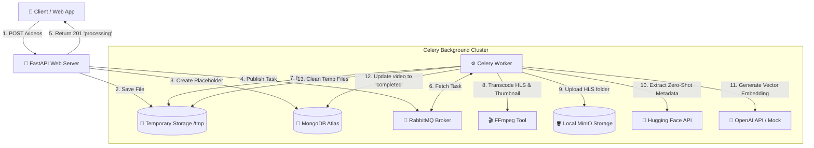
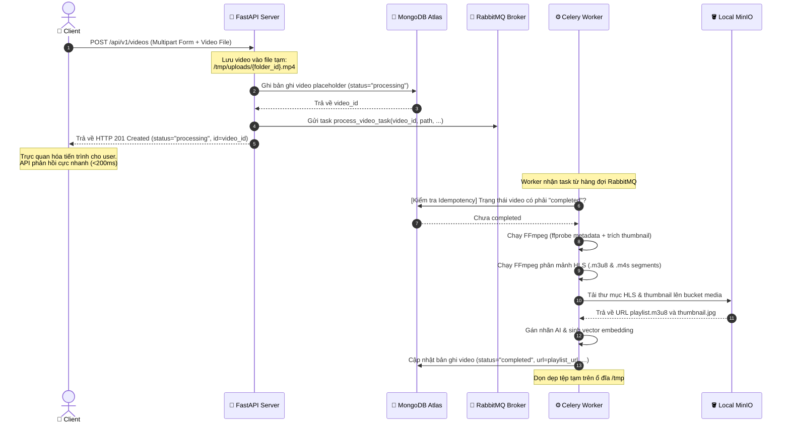
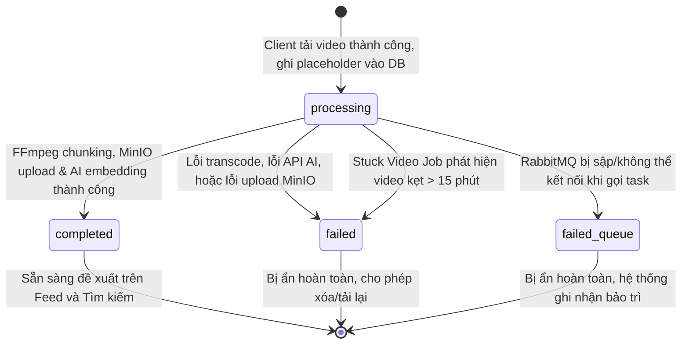

# Kiến Trúc và Cơ Chế Xử Lý Video Bất Đồng Bộ (Architecture & Mechanisms)

Tài liệu này mô tả chi tiết kiến trúc hệ thống, quy trình tuần tự của luồng tải video lên, vòng đời trạng thái của video trong cơ sở dữ liệu, và tác động của nó đối với công cụ đề xuất tin tức (Feed Recommendation Engine).

---

## 1. Sơ Đồ Kiến Trúc Hệ Thống (High-Level Architecture)

Hệ thống hoạt động theo cơ chế hướng sự kiện (event-driven / task queue pattern):



---

## 2. Quy Trình Tuần Tự (Sequence Diagram)

Quy trình từ lúc Client tải video lên cho đến khi video sẵn sàng hiển thị trên Feed:



---

## 3. Vòng Đời Trạng Thái Video (Database Video Status Lifecycle)

Mỗi video được đại diện bởi một tài liệu (document) trong collection `videos` chứa trường `status` lưu trữ trạng thái xử lý hiện thời.



### Chi tiết các trạng thái:
1. **`processing`**: Trạng thái mặc định ban đầu. Video đang nằm trong hàng đợi hoặc đang được xử lý bởi Celery Worker.
2. **`completed`**: Quá trình xử lý video (cắt HLS, tạo thumbnail, gán nhãn AI, sinh vector embedding) hoàn tất. Video đã sẵn sàng để phát trực tuyến và phân phối.
3. **`failed`**: Đã xảy ra lỗi trong quá trình xử lý nền (ví dụ: lỗi định dạng video, hết dung lượng đĩa, timeout tiến trình FFmpeg).
4. **`failed_queue`**: Không thể đẩy tác vụ vào hàng đợi do lỗi kết nối giữa FastAPI và RabbitMQ.

---

## 4. Tích Hợp Vào Hệ Thống Đề Xuất (Feed Recommendation Integration)

Để tránh hiện tượng người dùng nhìn thấy các video chưa xử lý xong (lỗi không phát được hoặc thiếu ảnh thu nhỏ), hệ thống Feed đã cấu hình lọc nghiêm ngặt theo trạng thái:

### A. Lọc Mặc Định Cho Feed & Trending
Tất cả các truy vấn danh sách, xếp hạng thịnh hành (Trending), hoặc lấy ngẫu nhiên calming videos đều được chèn thêm điều kiện lọc:
$$\{\text{"status"}: \text{"completed"}\}$$

* *Vị trí xử lý*: `VideoRepository.find_many`, `VideoRepository.find_trending`, và `VideoRepository.find_random_calming`.

### B. Lọc Trong Tìm Kiếm Vector Atlas (Vector Search Post-Filter)
Khi thực hiện truy vấn tìm kiếm ngữ nghĩa bằng vector (`$vectorSearch`), điều kiện lọc trạng thái được chèn vào tầng `$match` ngay sau bước tìm kiếm vector. Quy trình này đảm bảo chỉ các video có trạng thái `"completed"` mới được đưa vào công thức tính điểm Fatigue và rebalance feed:

```python
# Trích đoạn logic trong VideoRepository.vector_search
status_filter = {"status": "completed"}
combined_filter = {"$and": [status_filter, filter_stage]} if filter_stage else status_filter
pipeline.insert(1, {"$match": combined_filter})
```

Nhờ đó, tính nhất quán dữ liệu của người dùng được đảm bảo tuyệt đối, ngăn ngừa hoàn toàn tình trạng trải nghiệm phát video bị đứt gãy hoặc lỗi giao diện trên ứng dụng Client.
