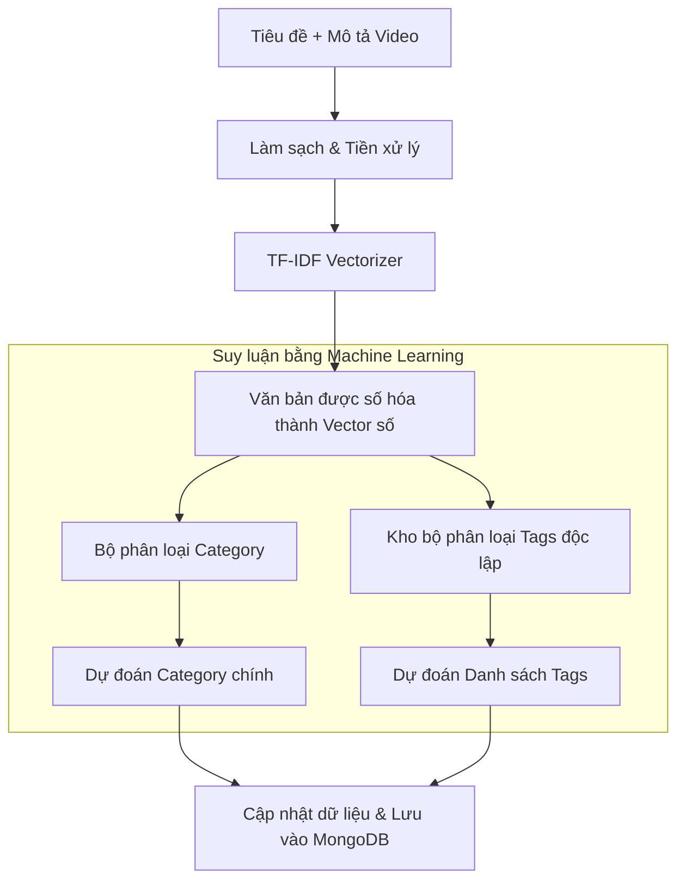

# Hướng Dẫn Hệ Thống Phân Loại Video Tự Động & Fine-Tuning (TF-IDF + Logistic Regression)

Tài liệu này giải thích chi tiết cơ chế hoạt động, thiết kế kỹ thuật và quy trình huấn luyện (fine-tuning) của hệ thống phân loại danh mục (Category) và thẻ (Tags) tự động cho video dựa trên tiêu đề và mô tả nội dung.

---

## 1. Tổng Quan Hệ Thống

Hệ thống phân loại tự động giúp giảm tải thao tác cho người dùng và người kiểm duyệt nội dung. Khi một video được tạo thông qua API mà không truyền thông tin phân loại, hệ thống sẽ sử dụng mô hình trí tuệ nhân tạo (cục bộ) để phân tích văn bản tiêu đề + mô tả nhằm:
1. **Dự đoán Category (Một nhóm duy nhất):** Chọn 1 trong 8 nhóm chính thuộc `CATEGORY_ENUM` (`lifestyle`, `education`, `entertainment`, `sports`, `calming`, `nature`, `gaming`, `cooking`).
2. **Dự đoán Tags (Nhiều thẻ phân loại):** Đề xuất danh sách thẻ tag phù hợp (tối đa 8 tags) dựa trên kho từ vựng thẻ hiện có trong database.

Hệ thống hoạt động hoàn toàn cục bộ (offline) trên máy chủ backend sử dụng thư viện **`scikit-learn`** để đảm bảo chi phí bằng 0 và tốc độ xử lý nhanh nhất có thể.

---

## 2. Kiến Trúc Kỹ Thuật (Dưới Lớp Vỏ)

Mô hình học máy sử dụng kết hợp hai kỹ thuật cơ bản nhưng cực kỳ hiệu quả cho phân loại văn bản: **TF-IDF Vectorizer** (trích xuất đặc trưng) và **Logistic Regression** (hồi quy logistic phân loại).



### A. Trích Xuất Đặc Trưng Văn Bản (TF-IDF Vectorizer)
Máy tính không thể học chữ viết trực tiếp, nó cần được số hóa thành dạng bảng số (vector). Chúng ta sử dụng **TF-IDF** (Term Frequency-Inverse Document Frequency) để định lượng tầm quan trọng của từng từ:

* **Tần suất từ (Term Frequency - TF):** Đo lường tần suất xuất hiện của từ khóa trong tài liệu. Từ khóa xuất hiện càng nhiều, trọng số càng lớn.
  $$\text{TF}(t, d) = \frac{\text{Số lần từ } t \text{ xuất hiện trong video } d}{\text{Tổng số từ trong video } d}$$
* **Tần suất tài liệu nghịch đảo (Inverse Document Frequency - IDF):** Giảm trọng số của các từ xuất hiện quá phổ biến ở mọi video (ví dụ: "video", "and", "the", "của", "là") và tăng trọng số cho các từ độc đáo, mang tính phân biệt cao (ví dụ: "pasta", "RTX", "gym").
  $$\text{IDF}(t, D) = \log \left( \frac{\text{Tổng số video } |D|}{1 + \text{Số video chứa từ } t} \right)$$
* **TF-IDF Score:**
  $$\text{TF-IDF}(t, d, D) = \text{TF}(t, d) \times \text{IDF}(t, D)$$

Trong hệ thống của chúng ta:
* Trích xuất cả từ đơn và từ ghép đôi (`ngram_range=(1, 2)`).
* Loại bỏ stop words tiếng Anh mặc định.
* Kích hoạt `sublinear_tf=True` (áp dụng thang đo logarit cho tần số từ) để giảm bớt ảnh hưởng của các từ lặp lại quá nhiều lần trong một đoạn mô tả ngắn.

### B. Phân Loại Danh Mục (Category Classifier)
* **Tính chất:** Phân loại đa lớp (Multiclass Classification) - mỗi video chỉ thuộc đúng một trong 8 danh mục duy nhất.
* **Thuật toán:** `LogisticRegression` kết hợp tham số `class_weight="balanced"` để tự động điều chỉnh trọng số phạt đối với các danh mục có ít dữ liệu mẫu, tránh việc mô hình bị thiên lệch (bias) về phía danh mục có nhiều video nhất.
* **Hoạt động:** Mô hình tính toán xác suất đầu ra cho từng danh mục trong số 8 danh mục, danh mục nào có xác suất cao nhất sẽ được lựa chọn.

### C. Phân Loại Thẻ Tag (Tags Classifier - Binary Relevance)
* **Tính chất:** Phân loại đa nhãn (Multilabel Classification) - một video có thể có nhiều tag khác nhau cùng lúc.
* **Cách giải quyết:** Áp dụng phương pháp **Binary Relevance** (Sự liên quan nhị phân).
  * Đối với mỗi nhãn tag độc nhất trong toàn bộ cơ sở dữ liệu (ví dụ: `fitness`, `gaming`, `food`,...), hệ thống sẽ huấn luyện một mô hình `LogisticRegression` nhị phân (Yes/No) độc lập.
  * Khi suy luận, từng mô hình nhị phân sẽ tự động đánh giá: *"Đoạn mô tả này có khớp với tag [X] hay không?"*. Nếu dự đoán là `1` (Yes), tag đó sẽ được thêm vào video.
  * **Tính bền vững cao:** Phương pháp này ngăn ngừa tình trạng lỗi hệ thống khi huấn luyện nếu trong cơ sở dữ liệu xuất hiện một tag cực kỳ hiếm (chỉ có 1 video chứa tag đó). Hệ thống sẽ tự động chuyển bộ phân loại tag đó thành giá trị dự đoán hằng số (Constant Classifier) an toàn thay vì cố gắng huấn luyện hồi quy gây crash.

---

## 3. Hệ Thống Dự Phòng Tự Động (Hugging Face Zero-Shot & Heuristics)

Khi hệ thống mới thiết lập (chưa có tệp mô hình `.pkl` do thiếu dữ liệu) hoặc khi từ vựng đầu vào hoàn toàn không khớp với dữ liệu huấn luyện của mô hình ML local, hệ thống sẽ tự động kích hoạt luồng dự phòng đa lớp có độ tin cậy cực cao:

### A. Tích hợp Hugging Face Zero-Shot Classification API
Ở đỉnh của luồng dự phòng, hệ thống sẽ cố gắng phân loại bằng cách gọi API Hugging Face Serverless Inference với mô hình Zero-Shot đa ngôn ngữ tiên tiến:
* **Mô hình:** `MoritzLaurer/mDeBERTa-v3-base-xnli-multilingual-nli-2mil7` (Hỗ trợ phân loại tiếng Việt cực tốt mà không cần huấn luyện trước).
* **Endpoint:** `https://router.huggingface.co/hf-inference/models/MoritzLaurer/mDeBERTa-v3-base-xnli-multilingual-nli-2mil7/pipeline/zero-shot-classification` (Sử dụng cổng router chính thức của Hugging Face).
* **Token:** Được cấu hình qua khóa `HF_API_TOKEN` trong file `.env`.
* **Cơ chế phân loại:** Mô hình tính toán độ tương đồng giữa văn bản (tiêu đề + mô tả) và danh sách 8 danh mục chính (`CATEGORY_ENUM`).
* **Tính tương thích định dạng:** Trình phân tích kết quả hỗ trợ linh hoạt cả cấu trúc danh sách từ điển nhị phân `[{"label": "...", "score": ...}, ...]` lẫn cấu trúc từ điển chứa mảng nhãn `{"labels": [...], "scores": [...]}` để tránh crash khi cấu trúc API thay đổi.
* **Cơ chế tải lại (Retry):** Nếu mô hình đang được nạp trên HF Serverless (lỗi 503), hệ thống sẽ tự động chờ tối đa 3 lần dựa trên thời gian ước tính `estimated_time` của API để hoàn tất yêu cầu.

### B. Cơ Chế Dự Phòng Local Heuristics (Luật dựa trên từ khóa)
Nếu cuộc gọi API tới Hugging Face bị lỗi (mất mạng, hết token, quá tải, hoặc văn bản đầu vào rỗng), hệ thống sẽ ngay lập tức kích hoạt bộ phân loại local dựa trên luật từ khóa để đảm bảo dịch vụ không bị gián đoạn:

1. **Khớp từ khóa danh mục:**
   * Hệ thống định nghĩa một bản đồ từ khóa đặc trưng cho cả tiếng Anh và tiếng Việt trong `app/utils/classifier.py` ứng với mỗi danh mục chính (Ví dụ: danh mục `cooking` có các từ khóa như: `cook`, `recipe`, `food`, `chef`, `nướng`, `nấu`, `ăn`, `bếp`).
   - Đếm số lần xuất hiện chính xác của các từ khóa này trong tiêu đề + mô tả.
   - Danh mục nào đạt điểm số trùng khớp cao nhất sẽ được chọn. Mặc định fallback về `entertainment` nếu không có từ khóa nào khớp.
2. **Trích xuất tag tự động:**
   - Sử dụng các tag mặc định ứng với danh mục chính được chọn (ví dụ: category `sports` $\rightarrow$ tag mặc định `sports`, `fitness`, `workout`, `gym`).
   - Thực hiện làm sạch văn bản (loại bỏ ký tự đặc biệt, chuyển chữ thường, loại bỏ các stop words tiếng Việt và tiếng Anh phổ biến như: *the, a, and, và, của, là, trong, cho, với...*).
   - Tách đoạn mô tả thành các từ đơn, đếm tần số xuất hiện của các từ đơn này và chọn ra top 5 từ xuất hiện nhiều nhất làm các tag bổ sung.

Nhờ cơ chế dự phòng đa tầng này, API tạo video **luôn chạy thành công** và trả về kết quả phân loại chuẩn xác cao trong mọi hoàn cảnh.

---

## 4. Luồng Xử Lý Dữ Liệu (Data Flow)

### A. Quy trình Huấn luyện (Fine-tuning Workflow)
Khi quản trị viên gọi endpoint `POST /api/v1/videos/train`:

1. **Đọc dữ liệu:** `VideoRepository` tải toàn bộ tài liệu video có sẵn trong MongoDB.
2. **Lọc dữ liệu sạch:** Loại bỏ các bản ghi không có thông tin mô tả, danh mục hoặc tag.
3. **Huấn luyện đặc trưng:** Đưa văn bản tiêu đề + mô tả vào `TfidfVectorizer` để học tập từ vựng và sinh ma trận đặc trưng $X$.
4. **Huấn luyện phân loại:**
   - Huấn luyện mô hình Category trên nhãn lớp.
   - Gom toàn bộ các tag độc nhất có trong database và huấn luyện song song danh sách mô hình nhị phân cho mỗi tag.
5. **Lưu trữ mô hình:** Serialize toàn bộ cấu trúc dữ liệu mô hình vào tệp `app/utils/model/classification_model.pkl` bằng thư viện `pickle`.

### B. Quy trình Suy luận (Inference Workflow)
Khi một video mới được tạo qua `POST /api/v1/videos`:

```
Client Request (Omitted Category & Tags)
                 │
                 ▼
     [video_controller.py] ── (Nhận Multipart Form-data)
                 │
                 ▼
       [video_service.py] ── (Kiểm tra xem trường category/tags có trống không?)
                 │
        ┌────────┴────────┐
   (Có trống)       (Không trống)
        │                 │
        ▼                 ▼
[classifier.py]     Sử dụng dữ liệu
(Chạy predict)       Client gửi lên
        │                 │
        └────────┬────────┘
                 │
                 ▼
       Tạo Vector Embedding 
  (Bao gồm cả Predicted Category/Tags)
                 │
                 ▼
          Lưu vào MongoDB
```

---

## 5. Chi Tiết API Endpoints

### A. Huấn luyện lại mô hình
* **Đường dẫn:** `POST /api/v1/videos/train`
* **Mô tả:** Huấn luyện (fine-tune) lại mô hình phân loại dựa trên dữ liệu MongoDB hiện có.
* **Response mẫu (200 OK):**
```json
{
  "success": true,
  "n_samples": 93,
  "category_accuracy": 0.989247311827957,
  "num_categories": 8,
  "num_tags": 127
}
```

### B. Tạo Video mới (Hỗ trợ Tự động Phân Loại)
* **Đường dẫn:** `POST /api/v1/videos`
* **Content-Type:** `multipart/form-data`
* **Tham số Form:**
  * `title` (Bắt buộc): Tiêu đề video
  * `description` (Bắt buộc): Mô tả video
  * `file` (Bắt buộc): Tệp tin video tải lên S3
  * `creator_id` (Bắt buộc): ID người tạo
  * `intensity_level` (Bắt buộc): Mức độ dopamine (`low`/`medium`/`high`)
  * `category` (Tùy chọn): Nếu bỏ qua, hệ thống sẽ tự điền bằng mô hình dự đoán.
  * `tags` (Tùy chọn - chuỗi ngăn cách bằng dấu phẩy): Nếu bỏ qua, hệ thống sẽ tự điền bằng mô hình dự đoán.

---

## 6. Hướng Dẫn Vận Hành & Kiểm Thử

### Chạy huấn luyện thủ công
Bạn có thể gọi trực tiếp endpoint bằng `curl`:
```bash
curl -X POST http://localhost:8033/api/v1/videos/train
```

Hoặc chạy script kiểm thử Python được chuẩn bị sẵn trong thư mục `scratch` để tự động hóa quy trình huấn luyện và kiểm tra tính chính xác của dự đoán:

1. **Chạy kiểm thử logic huấn luyện:**
   ```bash
   .venv/bin/python scratch/test_classification.py
   ```
2. **Chạy kiểm thử API Endpoint & Lưu Cơ Sở Dữ Liệu:**
   ```bash
   .venv/bin/python scratch/test_classification_api.py
   ```
