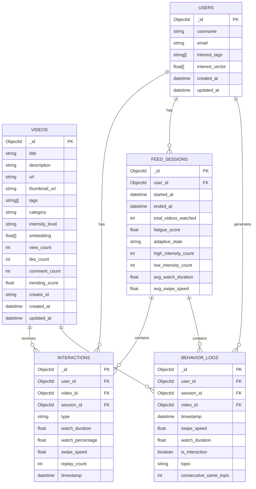

# 📐 GoTouchGrass — ERD & Schema Definitions

> Database: `gotouchgrass`
> Driver: `motor` (async Python MongoDB driver)
> Embedding Model: OpenAI `text-embedding-3-small` → 1536 dimensions

---

## 📊 ERD Diagram



---

## 🗂️ Collection 1: `videos`

**Mục đích:** Lưu toàn bộ metadata video + vector embedding phục vụ `$vectorSearch`.

| Field | Type | Required | Default | Mô tả |
|---|---|---|---|---|
| `_id` | `ObjectId` | auto | auto | Primary key tự động |
| `title` | `string` | ✅ | — | Tiêu đề video |
| `description` | `string` | ✅ | — | Mô tả ngắn nội dung video |
| `url` | `string` | ✅ | — | URL video (S3, CDN, hoặc YouTube link cho demo) |
| `thumbnail_url` | `string` | ❌ | `""` | URL ảnh thumbnail |
| `tags` | `[string]` | ✅ | — | Mảng 3 tags phân loại nội dung. VD: `["coding", "meme", "dark_humor"]` |
| `category` | `string` | ✅ | — | Nhóm lớn. Enum: `lifestyle`, `education`, `entertainment`, `sports`, `calming`, `nature`, `gaming`, `cooking` |
| `intensity_level` | `string` | ✅ | — | Mức độ "dopamine" của video. Enum: `high`, `medium`, `low`. Phân bố seed: 50% / 30% / 20% |
| `embedding` | `[float]` | ✅ | — | Vector 1536 chiều từ OpenAI `text-embedding-3-small`. Input: `title + description + category + tags` |
| `view_count` | `int` | ✅ | `0` | Tổng lượt xem |
| `like_count` | `int` | ✅ | `0` | Tổng lượt like |
| `comment_count` | `int` | ✅ | `0` | Tổng comment |
| `trending_score` | `float` | ✅ | `0.0` | Công thức: `view_count * 1 + like_count * 3 + comment_count * 5`. Cập nhật định kỳ |
| `creator_id` | `string` | ✅ | — | ID định danh creator (string slug, không cần ObjectId cho demo) |
| `created_at` | `datetime` | auto | `now()` | Thời điểm tạo document |
| `updated_at` | `datetime` | auto | `now()` | Thời điểm cập nhật gần nhất |

### 💡 intensity_level hoạt động như thế nào?

`intensity_level` được gán thủ công khi seed data, phân loại mức độ kích thích cảm xúc của video:

| Mức | Ví dụ nội dung |
|---|---|
| `high` | ragebait, drama, sigma edit, jump-cut nhanh, controversy |
| `medium` | tech review, tutorial, how-to, gaming highlights |
| `low` | rain ambience, slow travel, ASMR, lofi music, thiên nhiên |

**Tại sao là field cốt lõi của Phase 3?**

Khi `fatigue_score` vượt ngưỡng, Aggregation Pipeline thêm `$match` để rerank feed:

```
📱 Phase 1 (normal)    → $vectorSearch → không lọc intensity → trả về top match
📱 Phase 3 (exhausted) → $vectorSearch → $match { intensity_level: { $in: ["low", "medium"] } }
                                       → Boost video "low" lên đầu danh sách
```

Ví dụ cụ thể: User thích **football** nhưng đang mệt:
- ❌ Không gợi ý: `"Tranh cãi nảy lửa hậu trận đấu"` (high)
- ✅ Gợi ý thay thế: `"Slow-mo 10 bàn thắng đẹp nhất 2026"` (low)

Cùng topic, khác intensity — cá nhân hóa vẫn được giữ nguyên.

### 💡 embedding input — tại sao dùng title + description + category + tags?

```python
# ❌ Cũ — thiếu context ngữ nghĩa
embed_text = f"{title} {' '.join(tags)}"

# ✅ Đúng — giàu context như TikTok
embed_text = f"{title}. {description}. Category: {category}. Tags: {', '.join(tags)}"
```

Giải thích: Vector embedding phải capture đủ ngữ nghĩa để `$vectorSearch` tìm được video thực sự **liên quan về chủ đề**, không chỉ trùng từ khóa. `description` + `category` cung cấp context ngữ cảnh rộng hơn — đây là cách TikTok và các hệ thống recommendation lớn xây embedding.

**JSON Example:**
```json
{
  "_id": "ObjectId(...)",
  "title": "10 Coding Memes Only Devs Understand 😂",
  "description": "Relatable content for programmers who debug at 3AM. Funny and dark humor about software development life.",
  "url": "https://cdn.example.com/video-001.mp4",
  "thumbnail_url": "https://cdn.example.com/thumb-001.jpg",
  "tags": ["coding", "meme", "programmer"],
  "category": "entertainment",
  "intensity_level": "high",
  "embedding": [0.021, -0.087, 0.003],
  "view_count": 3200,
  "like_count": 540,
  "comment_count": 87,
  "trending_score": 4115.0,
  "creator_id": "creator_devjokes",
  "created_at": "2026-05-01T08:00:00Z",
  "updated_at": "2026-05-17T06:00:00Z"
}
```

---

## 🗂️ Collection 2: `users`

**Mục đích:** Lưu profile người dùng và vector sở thích — đầu vào cho `$vectorSearch`.

| Field | Type | Required | Default | Mô tả |
|---|---|---|---|---|
| `_id` | `ObjectId` | auto | auto | Primary key |
| `username` | `string` | ✅ | — | Tên hiển thị. Unique |
| `email` | `string` | ❌ | `""` | Email người dùng |
| `interest_tags` | `[string]` | ✅ | — | **2 tags** user chọn trong màn hình **Onboarding** (lần đầu mở app). Static — không thay đổi sau khi set. VD: `["coding", "football"]` |
| `interest_vector` | `[float]` | ✅ | — | Vector 1536 chiều. Khởi tạo = trung bình embedding của các video thuộc `interest_tags`. **Dynamic** — cập nhật sau mỗi batch tương tác bằng weighted average |
| `created_at` | `datetime` | auto | `now()` | |
| `updated_at` | `datetime` | auto | `now()` | Cập nhật mỗi khi `interest_vector` thay đổi |

### 💡 interest_tags được xác định từ đâu?

```
[Lần đầu mở app — Onboarding Screen]
  "Bạn thích nội dung gì?"
  ☑ coding   ☐ football   ☑ calming   ☐ gaming ...
  → User chọn 2 → POST /users { interest_tags: ["coding", "calming"] }
        ↓
  Backend lấy embedding trung bình của các video có tag "coding" và "calming"
        ↓
  Ghi vào users.interest_vector (vector khởi tạo)
```

**Có liên quan `feed_sessions` không?** → **Không trực tiếp.** Mối quan hệ là:

```
interest_tags  → khởi tạo → interest_vector  → $vectorSearch → feed
                                    ↑
                          interactions (like/skip) → weighted average update

feed_sessions  → chỉ track fatigue/wellbeing của phiên lướt, không đụng đến interest
```

`interest_tags` là **hạt giống ban đầu**, `interest_vector` là **cây đang lớn** theo thời gian.

**JSON Example:**
```json
{
  "_id": "ObjectId(...)",
  "username": "tgkhanh_dev",
  "email": "khanh@example.com",
  "interest_tags": ["coding", "football"],
  "interest_vector": [0.041, -0.023, 0.011],
  "created_at": "2026-05-17T00:00:00Z",
  "updated_at": "2026-05-17T13:00:00Z"
}
```

---

## 🗂️ Collection 3: `interactions`

**Mục đích:** Append-only log các **business event** có chủ ý (like, skip, replay...). Nguồn dữ liệu duy nhất để **update `interest_vector`** — trả lời câu hỏi *"User muốn xem gì?"*

| Field | Type | Required | Default | Mô tả |
|---|---|---|---|---|
| `_id` | `ObjectId` | auto | auto | Primary key |
| `user_id` | `ObjectId` | ✅ | — | Ref → `users._id` |
| `video_id` | `ObjectId` | ✅ | — | Ref → `videos._id` |
| `session_id` | `ObjectId` | ✅ | — | Ref → `feed_sessions._id` |
| `type` | `string` | ✅ | — | Enum: `like`, `skip`, `comment`, `replay`, `share`. Trọng số update vector: `like=1.0`, `replay=0.8`, `comment=0.6`, `skip=-0.3` |
| `watch_duration` | `float` | ✅ | `0.0` | Thời gian xem (giây). Ví dụ: `28.5` |
| `watch_percentage` | `float` | ✅ | `0.0` | Tỉ lệ đã xem từ 0.0 → 1.0. `> 0.8` = xem gần hết = tín hiệu tích cực mạnh |
| `swipe_speed` | `float` | ✅ | `0.0` | Tốc độ vuốt (px/giây) khi rời khỏi video. `0.0` = chưa vuốt |
| `replay_count` | `int` | ✅ | `0` | Số lần xem lại trong cùng 1 lần view |
| `timestamp` | `datetime` | auto | `now()` | Thời điểm xảy ra event |

**JSON Example:**
```json
{
  "_id": "ObjectId(...)",
  "user_id": "ObjectId(user_123)",
  "video_id": "ObjectId(video_456)",
  "session_id": "ObjectId(session_789)",
  "type": "like",
  "watch_duration": 28.5,
  "watch_percentage": 0.95,
  "swipe_speed": 0.0,
  "replay_count": 1,
  "timestamp": "2026-05-17T13:01:22Z"
}
```

---

## ⚡ interactions vs behavior_logs — Tại sao tách 2 collection?

> Bạn hiểu **đúng hoàn toàn**. Đây là design decision quan trọng nhất của schema.

### Góc nhìn nghiệp vụ

```
interactions   = "User muốt gì?"          → Recommendation Engine
behavior_logs  = "User cảm thấy thế nào?" → Wellbeing / Fatigue Engine
```

| | `interactions` | `behavior_logs` |
|---|---|---|
| **Câu hỏi trả lời** | User thích topic nào? | User có đang mệt không? |
| **Event trigger** | User **chủ động**: like, skip, replay | **Mỗi video** user xem — kể cả passive |
| **Dùng để** | Update `interest_vector` | Tính `fatigue_score` |
| **Đọc khi** | `GET /feed` → query history để re-embed | `GET /feed` → Aggregation Pipeline 10-20 logs gần nhất |

### Góc nhìn kỹ thuật — Tại sao không gộp chung?

| Vấn đề | Nếu gộp chung | Sau khi tách |
|---|---|---|
| **Write frequency** | `behavior_logs` write rất dày (mỗi video = 1 doc), làm collection phình to nhanh | Tách → mỗi collection scale độc lập |
| **Collection type** | Không thể dùng Time-Series cho cả hai cùng lúc | `behavior_logs` là Time-Series (tối ưu append + range query theo thời gian), `interactions` là Regular |
| **Index khác nhau** | Phải đánh đổi index cho 2 use-case khác nhau | Mỗi collection có index tối ưu riêng |
| **Retention policy** | Không thể set TTL riêng | `behavior_logs` có thể TTL sau 30 ngày (chỉ cần data gần đây để tính fatigue). `interactions` giữ lâu dài (lịch sử sở thích) |
| **Read/Write isolation** | Aggregation Pipeline tính fatigue phải scan qua cả `like/skip` events → chậm | Mỗi query đọc đúng collection của nó → nhanh, không block nhau |

### Luồng dữ liệu thực tế

```
[User xem video X]
         │
         ├──► INSERT behavior_logs { swipe_speed, watch_duration, is_interaction: false }
         │           → Time-series, write nhanh, không cần ack ngay
         │
         └── [User bấm LIKE]
                  │
                  ├──► INSERT interactions { type: "like", watch_percentage: 0.95 }
                  │           → Business event, cần đảm bảo lưu thành công
                  │
                  └──► UPDATE users.interest_vector (weighted average với video.embedding)
                             → Recommendation engine cập nhật sở thích
```

---

## 🗂️ Collection 4: `feed_sessions`

**Mục đích:** Theo dõi toàn bộ 1 phiên lướt của user. Lưu Fatigue Score tổng hợp và trạng thái adaptive.

| Field | Type | Required | Default | Mô tả |
|---|---|---|---|---|
| `_id` | `ObjectId` | auto | auto | Primary key |
| `user_id` | `ObjectId` | ✅ | — | Ref → `users._id` |
| `started_at` | `datetime` | auto | `now()` | Thời điểm bắt đầu phiên lướt |
| `ended_at` | `datetime` | ❌ | `null` | `null` = session đang active. Cập nhật khi user đóng app/tab |
| `total_videos_watched` | `int` | ✅ | `0` | Số video đã xem trong session (increment sau mỗi interaction) |
| `fatigue_score` | `float` | ✅ | `0.0` | **Điểm mệt mỏi 0-100.** Tính từ Aggregation Pipeline. Tăng khi: swipe nhanh, watch ngắn, passive scroll, cùng topic lặp lại |
| `adaptive_state` | `string` | ✅ | `"normal"` | **State machine Phase 3.** Enum: `normal` (score < 40), `warning` (40-70), `exhausted` (>70) |
| `high_intensity_count` | `int` | ✅ | `0` | Số video `intensity_level = "high"` đã xem trong session |
| `low_intensity_count` | `int` | ✅ | `0` | Số video `intensity_level = "low"` đã xem trong session |
| `avg_watch_duration` | `float` | ✅ | `0.0` | Trung bình thời gian xem (giây) trong session |
| `avg_swipe_speed` | `float` | ✅ | `0.0` | Trung bình tốc độ vuốt (px/giây) trong session |

**JSON Example:**
```json
{
  "_id": "ObjectId(...)",
  "user_id": "ObjectId(user_123)",
  "started_at": "2026-05-17T13:00:00Z",
  "ended_at": null,
  "total_videos_watched": 12,
  "fatigue_score": 67.5,
  "adaptive_state": "warning",
  "high_intensity_count": 9,
  "low_intensity_count": 3,
  "avg_watch_duration": 14.2,
  "avg_swipe_speed": 820.5
}
```

**Fatigue Score Formula:**
```
fatigue_score =
  (avg_swipe_speed / 1500 * 30)       # tốc độ vuốt nhanh → mệt
  + ((1 - avg_watch_pct) * 30)        # xem ít → mệt
  + (high_intensity_ratio * 25)       # nhiều content cường độ cao
  + (passive_ratio * 15)              # ít tương tác → lướt thụ động
```

---

## 🗂️ Collection 5: `behavior_logs`

**Mục đích:** Time-series log hành vi thô từng video, phục vụ Aggregation Pipeline tính Fatigue Score theo sliding window.

| Field | Type | Required | Default | Mô tả |
|---|---|---|---|---|
| `_id` | `ObjectId` | auto | auto | Primary key |
| `user_id` | `ObjectId` | ✅ | — | Ref → `users._id` |
| `session_id` | `ObjectId` | ✅ | — | Ref → `feed_sessions._id` |
| `video_id` | `ObjectId` | ✅ | — | Ref → `videos._id` |
| `timestamp` | `datetime` | auto | `now()` | **timeField** cho MongoDB Time-Series collection |
| `swipe_speed` | `float` | ✅ | `0.0` | px/giây khi vuốt qua video này |
| `watch_duration` | `float` | ✅ | `0.0` | Số giây đã xem |
| `is_interaction` | `bool` | ✅ | `false` | `true` nếu user có like/comment/replay. `false` = passive scroll |
| `topic` | `string` | ✅ | — | Tag chủ đề chính của video (tags[0]) |
| `consecutive_same_topic` | `int` | ✅ | `0` | Số video cùng topic liên tiếp tính đến thời điểm này. Cao → emotional saturation |

**JSON Example:**
```json
{
  "_id": "ObjectId(...)",
  "user_id": "ObjectId(user_123)",
  "session_id": "ObjectId(session_789)",
  "video_id": "ObjectId(video_456)",
  "timestamp": "2026-05-17T13:01:22Z",
  "swipe_speed": 850.0,
  "watch_duration": 5.2,
  "is_interaction": false,
  "topic": "sigma",
  "consecutive_same_topic": 4
}
```

---

## 🔑 Index Strategy

```js
// 1. Vector Search Index — tạo thủ công trên Atlas UI
// Collection: videos | Field: embedding | Dimensions: 1536 | Similarity: cosine

// 2. Regular Indexes (tạo qua script)
db.videos.createIndex({ trending_score: -1 })
db.videos.createIndex({ tags: 1, category: 1 })
db.videos.createIndex({ intensity_level: 1 })

db.interactions.createIndex({ user_id: 1, timestamp: -1 })
db.interactions.createIndex({ session_id: 1 })
db.interactions.createIndex({ video_id: 1 })

db.feed_sessions.createIndex({ user_id: 1, started_at: -1 })
db.feed_sessions.createIndex({ user_id: 1, ended_at: 1 })

db.behavior_logs.createIndex({ session_id: 1, timestamp: 1 })
db.behavior_logs.createIndex({ user_id: 1, timestamp: -1 })
```

---

## ⚠️ Ghi chú quan trọng

> **`behavior_logs`** nên được tạo là **Time-Series Collection** trong MongoDB:
> ```js
> db.createCollection("behavior_logs", {
>   timeseries: {
>     timeField: "timestamp",
>     metaField: "session_id",
>     granularity: "seconds"
>   }
> })
> ```
> Time-Series collection tối ưu storage và query cho dữ liệu theo thời gian.
