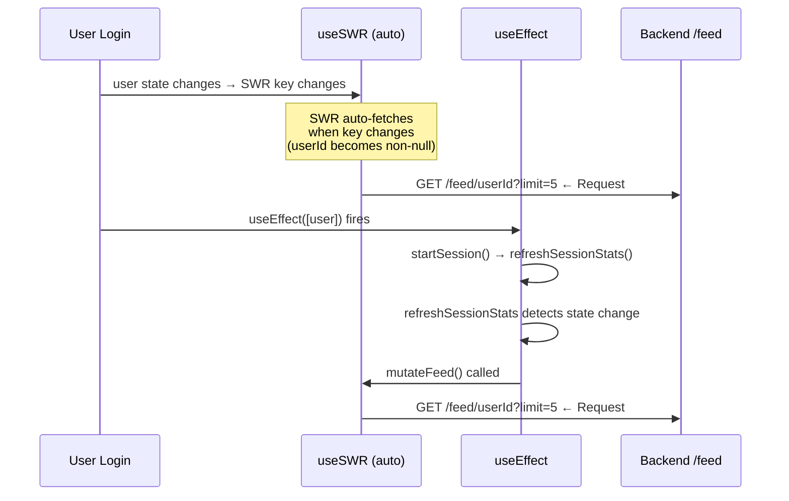
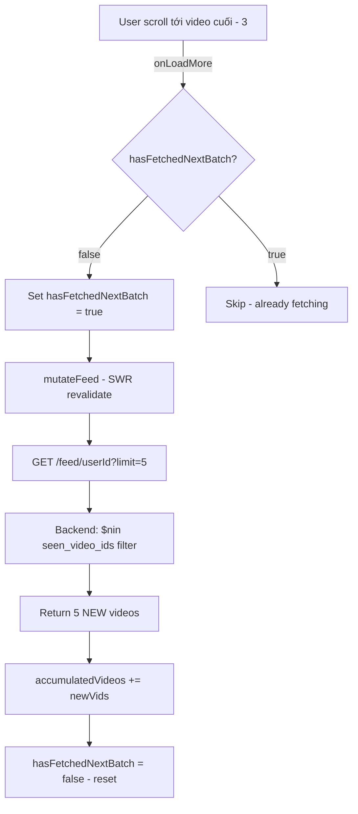

# 🚀 Phase 3 Implementation Plan — Aggregation Pipeline Cải thiện + Bug Fix

**Ngày:** 25/05/2026  
**Scope:** Backend aggregation pipeline + Frontend duplicate feed bug  
**Ước lượng:** ~2.5 giờ (bao gồm bug fix)

---

## 📋 Mục lục

1. [🐛 Bug Investigation: Duplicate Feed API Calls](#-bug-1-duplicate-feed-api-calls-on-login)
2. [🐛 Bug Investigation: Pipeline Next Feed](#-bug-2-pipeline-có-gọi-được-feed-tiếp-theo-không)
3. [⚙️ Task 3a: Dynamic Weights](#-task-3a-điều-chỉnh-trọng-số-động)
4. [⚙️ Task 3b: Palette Cleanser Injection](#-task-3b-palette-cleanser-injection)
5. [⚙️ Task 3c: Intensity Priority Sorting](#-task-3c-intensity-priority-sorting)
6. [⚙️ Task 3d: E2E Test Updates](#-task-3d-e2e-test-updates)
7. [📅 Implementation Order](#-implementation-order)

---

## 🐛 Bug 1: Duplicate Feed API Calls on Login

### Root Cause Analysis

Khi login, FE gửi **2 request feed cùng lúc**. Nguyên nhân gốc nằm ở **3 cơ chế chạy đồng thời**:



#### Chi tiết 3 nguồn gây duplicate:

**Nguồn 1 — SWR Auto-fetch (L64, [client.ts](file:///home/nhphat/Personal/WorkSpace/Hackathon/frontend/src/api/client.ts#L63-L74)):**
```typescript
// SWR tự động fetch khi key thay đổi từ null → valid URL
const { data, mutate } = useSWR<VideoResponse[]>(
  userId ? `${API_URL}/feed/${userId}?limit=${limit}` : null, // ← key changes on login
  fetcher
);
```
Khi `userId` thay đổi từ `null` → `"abc123"`, SWR tự động trigger fetch lần 1.

**Nguồn 2 — refreshSessionStats → mutateFeed() (L189-194, [App.tsx](file:///home/nhphat/Personal/WorkSpace/Hackathon/frontend/src/App.tsx#L179-L199)):**
```typescript
const refreshSessionStats = async () => {
  const sessionData = await getSession(sid);
  const isExhaustedOrWarning = ...;
  if (isExhaustedOrWarning !== isMindfulActive) {
    setIsMindfulActive(isExhaustedOrWarning);
    if (user) {
      mutateFeed(); // ← Request #2: always triggers on first login because 
                     // initial isMindfulActive=false and session may differ
    }
  }
};
```

**Nguồn 3 — React StrictMode (Development only):**
React StrictMode mount/unmount/remount components, có thể khiến `useEffect([user])` chạy 2 lần.

### Fix đề xuất

> [!IMPORTANT]
> Fix chính: Trong `refreshSessionStats`, chỉ gọi `mutateFeed()` khi state **thực sự thay đổi** (so sánh previous vs current), không gọi ở lần khởi tạo đầu tiên.

**File:** [App.tsx](file:///home/nhphat/Personal/WorkSpace/Hackathon/frontend/src/App.tsx)

```diff
 function App() {
+  // Track if the initial SWR fetch has happened, so we don't double-fetch
+  const hasInitialFeedFetched = useRef(false);

   const refreshSessionStats = async (activeSessionId?: string | null) => {
     const sid = activeSessionId !== undefined ? activeSessionId : sessionId;
     if (!sid) return;
     try {
       const sessionData = await getSession(sid);
       const newScore = Math.round(sessionData.fatigue_score);
       const isExhaustedOrWarning = sessionData.adaptive_state === 'warning' || sessionData.adaptive_state === 'exhausted';
       
       setFatigueScore(newScore);
       
-      if (isExhaustedOrWarning !== isMindfulActive) {
+      // Only trigger feed refetch when mindful state ACTUALLY changes,
+      // AND not on the very first load (SWR already fetched automatically)
+      if (isExhaustedOrWarning !== isMindfulActive && hasInitialFeedFetched.current) {
         setIsMindfulActive(isExhaustedOrWarning);
-        // Force refetch feed since the fatigue state changed
         if (user) {
           mutateFeed();
         }
+      } else {
+        setIsMindfulActive(isExhaustedOrWarning);
       }
+      hasInitialFeedFetched.current = true;
     } catch (error) {
       console.error('Error fetching session stats:', error);
     }
   };
```

**Tác dụng:**
- Lần login đầu: SWR auto-fetch 1 lần (vì key changes). `refreshSessionStats` chạy nhưng **không** gọi `mutateFeed()` vì `hasInitialFeedFetched.current === false`.
- Các lần sau (fatigue state thay đổi): `mutateFeed()` chỉ gọi khi `isMindfulActive` thực sự đổi giá trị.

---

## 🐛 Bug 2: Pipeline có gọi được Feed tiếp theo không?

### Kết luận: ✅ CÓ — Pipeline **hoạt động đúng** cho next feed

#### Cơ chế hiện tại:



**Tại sao nó hoạt động:**

1. **feedLimit luôn = 5** (constant, L114 [App.tsx](file:///home/nhphat/Personal/WorkSpace/Hackathon/frontend/src/App.tsx#L114)). Mỗi lần gọi feed API đều request `limit=5`.

2. **Backend dedup** ([feed_service.py L70-98](file:///home/nhphat/Personal/WorkSpace/Hackathon/backend/app/services/feed_service.py#L70-L98)): Lấy tất cả `video_id` từ interactions + behavior_logs của session, exclude qua `$nin` filter → mỗi batch luôn trả về video mới.

3. **FE accumulation** ([App.tsx L152-163](file:///home/nhphat/Personal/WorkSpace/Hackathon/frontend/src/App.tsx#L152-L163)):
   ```typescript
   useEffect(() => {
     const newVids = currentVideos.filter(cv => !prev.find(p => p.id === cv.id));
     return newVids.length > 0 ? [...prev, ...newVids] : prev;
   }, [currentVideos]);
   ```

4. **Guard mechanism** ([App.tsx L125](file:///home/nhphat/Personal/WorkSpace/Hackathon/frontend/src/App.tsx#L125)): `hasFetchedNextBatch` ref ngăn multiple fetches cho cùng 1 batch.

### Vấn đề tiềm ẩn

> [!WARNING]
> **Race condition nhẹ**: Nếu `mutateFeed()` chưa complete mà user scroll rất nhanh qua nhiều video, `hasFetchedNextBatch` đã = `true` nên sẽ bỏ qua → **ĐÚNG HÀNH VI**, nhưng có thể miss 1 trigger nếu batch nhỏ. Với `BATCH_SIZE=5` và threshold `videos.length - 3`, cần scroll qua 2 video mới mới trigger → **đủ an toàn**.

> [!NOTE]
> Tuy nhiên, **nếu backend không trả đủ 5 video** (hết video phù hợp), `currentVideos` sẽ không thay đổi → `hasFetchedNextBatch` không được reset → **không fetch thêm nữa**. Đây là behavior mong muốn (dừng khi hết data).

---

## ⚙️ Task 3a: Điều chỉnh Trọng số Động

### Mục tiêu
Thay `search_weight=10.0` và `trending_weight=0.001` (cố định) thành giá trị động dựa trên `adaptive_state`.

### File: [feed_service.py](file:///home/nhphat/Personal/WorkSpace/Hackathon/backend/app/services/feed_service.py)

**Bước 1 — Thêm helper method (sau class declaration, ~L37):**

```python
@staticmethod
def _get_adaptive_weights(adaptive_state: str) -> tuple[float, float]:
    """Return (search_weight, trending_weight) based on fatigue state.
    
    - normal:    Maximize personalization (high search, low trending)
    - warning:   Balance personal + calming content
    - exhausted: Prioritize trending/calming over vector similarity
    """
    if adaptive_state == "exhausted":
        return (5.0, 0.5)
    elif adaptive_state == "warning":
        return (7.0, 0.1)
    else:  # "normal"
        return (10.0, 0.001)
```

**Bước 2 — Resolve adaptive state + weights trước feed generation (L103-118):**

```diff
         # 4. Generate feed (cold-start or personalized)
         interest_vector = user.get("interest_vector", [])
 
+        # Resolve adaptive weights based on fatigue state
+        adaptive_state = "normal"
+        if active_session:
+            adaptive_state = active_session.get("adaptive_state", "normal")
+        search_weight, trending_weight = self._get_adaptive_weights(adaptive_state)
+
         if not interest_vector or len(interest_vector) == 0:
             logger.info(f"❄️ Cold start feed for user: {user_id} (fetching trending videos)")
             docs = await self._video_repo.find_trending(limit=limit, filter_stage=combined_filter)
         else:
-            logger.info(f"🌿 Personalized feed for user: {user_id} (running Vector Search)")
+            logger.info(
+                f"🌿 Personalized feed for user: {user_id} | state={adaptive_state} "
+                f"| weights=({search_weight}, {trending_weight})"
+            )
             docs = await self._video_repo.vector_search(
                 query_vector=interest_vector,
                 limit=limit,
                 num_candidates=max(limit * 10, 50),
                 filter_stage=combined_filter,
-                search_weight=10.0,
-                trending_weight=0.001,
+                search_weight=search_weight,
+                trending_weight=trending_weight,
             )
```

### Validation
- [ ] Log hiện `state=exhausted | weights=(5.0, 0.5)` khi fatigue > 70
- [ ] Log hiện `state=warning | weights=(7.0, 0.1)` khi fatigue 40-70
- [ ] Feed khi normal không bị ảnh hưởng

---

## ⚙️ Task 3b: Palette Cleanser Injection

### Mục tiêu
Khi `exhausted`, bơm 1 video ngẫu nhiên từ danh mục `calming`/`nature` vào vị trí index 1 của feed.

### File 1: [video_repository.py](file:///home/nhphat/Personal/WorkSpace/Hackathon/backend/app/repositories/video_repository.py) — Thêm method mới

```python
async def find_random_calming(
    self,
    exclude_ids: set,
    calming_categories: List[str] = None,
    intensity_level: str = "low",
    limit: int = 1,
) -> Optional[Dict[str, Any]]:
    """Find a random calming video for palette cleanser injection.
    
    Uses MongoDB $sample for true random selection from calming categories,
    excluding already-seen videos in the current session.
    """
    from bson import ObjectId

    if calming_categories is None:
        calming_categories = ["calming", "nature", "comedy", "music", "art"]

    match_filter: Dict[str, Any] = {
        "category": {"$in": calming_categories},
        "intensity_level": intensity_level,
    }

    if exclude_ids:
        valid_oids = [ObjectId(vid) for vid in exclude_ids if ObjectId.is_valid(vid)]
        if valid_oids:
            match_filter["_id"] = {"$nin": valid_oids}

    pipeline = [
        {"$match": match_filter},
        {"$sample": {"size": limit}},
    ]
    results = await self.aggregate(pipeline)
    return results[0] if results else None
```

> [!IMPORTANT]
> Sử dụng categories có sẵn trong `CATEGORY_ENUM`: `calming`, `nature`, `comedy`, `music`, `art`. KHÔNG dùng `asmr`, `lofi`, `mindfulness` vì chúng **không tồn tại** trong enum.

### File 2: [feed_service.py](file:///home/nhphat/Personal/WorkSpace/Hackathon/backend/app/services/feed_service.py) — Thêm logic injection

Sau exploration block (L145), trước `return`:

```diff
                     logger.info(
                         f"🚀 Exploration: Injected trending video '{exploration_video.get('title')}' "
                         f"({exploration_video.get('id')}) to break filter bubble."
                     )

+        # 6. Palette Cleanser Injection (exhausted state only)
+        if adaptive_state == "exhausted" and limit >= 3 and len(docs) >= 2:
+            cleanser = await self._video_repo.find_random_calming(
+                exclude_ids=seen_set | {doc["id"] for doc in docs},
+                calming_categories=["calming", "nature"],
+                intensity_level="low",
+            )
+            if cleanser:
+                docs.insert(1, cleanser)  # Position 2 (index 1)
+                # Trim to respect original limit
+                if len(docs) > limit:
+                    docs = docs[:limit]
+                logger.info(
+                    f"🍃 Palette cleanser injected: '{cleanser.get('title')}' "
+                    f"(category={cleanser.get('category')})"
+                )

         return [VideoService._to_response(doc) for doc in docs]
```

### Validation
- [ ] Khi `exhausted` + `limit >= 3`: log hiện `🍃 Palette cleanser injected`
- [ ] Video cleanser có `category` là `calming` hoặc `nature`
- [ ] Feed vẫn đúng `limit` items (docs bị trim nếu thừa)
- [ ] Cleanser KHÔNG trùng với video đã xem trong session

---

## ⚙️ Task 3c: Intensity Priority Sorting

### Mục tiêu
Khi `exhausted`, sort video `low` intensity lên đầu trước khi áp dụng `total_score`.

### File 1: [video_repository.py](file:///home/nhphat/Personal/WorkSpace/Hackathon/backend/app/repositories/video_repository.py) — Sửa `vector_search()`

```diff
     async def vector_search(
         self,
         query_vector: List[float],
         limit: int = 10,
         num_candidates: int = 100,
         filter_stage: Optional[Dict[str, Any]] = None,
         search_weight: float = 100.0,
         trending_weight: float = 1.0,
+        adaptive_state: str = "normal",
     ) -> List[Dict[str, Any]]:
         """
         Perform $vectorSearch on the videos collection, calculating a combined
         total_score (search_score * search_weight + trending_score * trending_weight)
         and sorting by it.
+
+        When adaptive_state is "exhausted", an intensity_rank field is added so
+        that low-intensity videos always sort before higher-intensity ones.
         Requires a Vector Search Index named 'video_embedding_index' on Atlas.
         """
         pipeline = [
             ...existing stages...
-            {
-                "$sort": {
-                    "total_score": -1
-                }
-            }
         ]
 
+        # Adaptive sorting: prioritize low-intensity when exhausted
+        if adaptive_state == "exhausted":
+            pipeline.append({
+                "$addFields": {
+                    "intensity_rank": {
+                        "$switch": {
+                            "branches": [
+                                {"case": {"$eq": ["$intensity_level", "low"]}, "then": 0},
+                                {"case": {"$eq": ["$intensity_level", "medium"]}, "then": 1},
+                            ],
+                            "default": 2  # high
+                        }
+                    }
+                }
+            })
+            pipeline.append({"$sort": {"intensity_rank": 1, "total_score": -1}})
+        else:
+            pipeline.append({"$sort": {"total_score": -1}})

         # Optional post-filter
         if filter_stage:
             pipeline.insert(1, {"$match": filter_stage})

         return await self.aggregate(pipeline)
```

> [!TIP]
> Dùng `$switch` thay vì alphabetical sort vì `"high" < "low" < "medium"` theo alphabet — sai thứ tự! `$switch` đảm bảo: `low(0)` → `medium(1)` → `high(2)`.

### File 2: [feed_service.py](file:///home/nhphat/Personal/WorkSpace/Hackathon/backend/app/services/feed_service.py) — Truyền `adaptive_state`

```diff
             docs = await self._video_repo.vector_search(
                 query_vector=interest_vector,
                 limit=limit,
                 num_candidates=max(limit * 10, 50),
                 filter_stage=combined_filter,
                 search_weight=search_weight,
                 trending_weight=trending_weight,
+                adaptive_state=adaptive_state,
             )
```

### Validation
- [ ] Khi exhausted: video đầu tiên luôn `intensity_level == "low"`
- [ ] Khi normal: thứ tự feed không thay đổi
- [ ] Không lỗi khi `intensity_level` field không tồn tại (default = 2)

---

## ⚙️ Task 3d: E2E Test Updates

### File: [test_interaction_e2e.py](file:///home/nhphat/Personal/WorkSpace/Hackathon/backend/scratch/test_interaction_e2e.py)

**Thêm sau wellbeing filter assertions (L215), trước step 7:**

```python
    # ── Phase 3 Assertions ──────────────────────────────────────────
    print("\n[6b/7] Validating Phase 3: Intensity Prioritization & Palette Cleanser...")
    
    # 3a. Dynamic Weights — verified implicitly via log
    print(f"✅ Dynamic weights applied (state={adaptive_state})")
    
    # 3c. Intensity Prioritization — first video should be low-intensity
    if len(fatigue_feed) > 0:
        assert fatigue_feed[0].intensity_level == "low", \
            f"❌ First video should be low-intensity when exhausted, got {fatigue_feed[0].intensity_level}"
        print(f"✅ Intensity priority: First video is low-intensity ('{fatigue_feed[0].title}')")
    
    # 3b. Palette Cleanser — check for calming category in feed
    calming_categories = ["calming", "nature"]
    has_calming = any(v.category in calming_categories for v in fatigue_feed)
    if adaptive_state == "exhausted":
        if has_calming:
            calming_video = next(v for v in fatigue_feed if v.category in calming_categories)
            print(f"✅ Palette cleanser found: '{calming_video.title}' (category={calming_video.category})")
        else:
            print(f"⚠️  No calming category video found (may not have calming videos in test DB)")
    
    # Count verification
    low_count = sum(1 for v in fatigue_feed if v.intensity_level == "low")
    print(f"📊 Feed composition: {low_count}/{len(fatigue_feed)} low-intensity videos")
    
    print("✅ Phase 3 assertions passed!")
```

---

## 📅 Implementation Order

| # | Task | File(s) | Thời gian | Phụ thuộc |
|---|------|---------|-----------|-----------|
| 1 | 🐛 Fix duplicate feed | `frontend/src/App.tsx` | 10 phút | Không |
| 2 | ⚙️ 3a: Dynamic Weights | `backend/.../feed_service.py` | 20 phút | Không |
| 3 | ⚙️ 3c: Intensity Sorting | `backend/.../video_repository.py` + `feed_service.py` | 20 phút | 3a |
| 4 | ⚙️ 3b: Palette Cleanser | `backend/.../video_repository.py` + `feed_service.py` | 30 phút | Không |
| 5 | ⚙️ 3d: E2E Tests | `backend/scratch/test_interaction_e2e.py` | 15 phút | 3a,3b,3c |
| | **Tổng** | | **~1.5 giờ** | |

### Thứ tự thực hiện khuyến nghị:

```
FE fix (duplicate) → 3a (weights) → 3c (sorting) → 3b (cleanser) → 3d (tests)
```

---

## ✅ Final Validation Checklist

Sau khi implement xong:

- [ ] **FE**: Login chỉ tạo 1 request feed (kiểm tra Network tab)
- [ ] **3a**: Log hiện `weights=(5.0, 0.5)` khi exhausted
- [ ] **3b**: Log hiện `🍃 Palette cleanser injected` khi exhausted
- [ ] **3c**: Video đầu tiên luôn `low` intensity khi exhausted
- [ ] **3d**: `python backend/scratch/test_interaction_e2e.py` pass
- [ ] **Regression**: Feed hoạt động bình thường khi `normal` state
- [ ] **Performance**: Response time < 500ms
