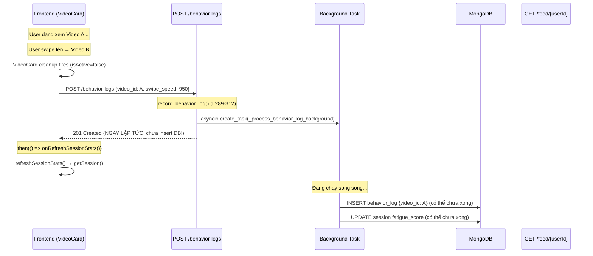
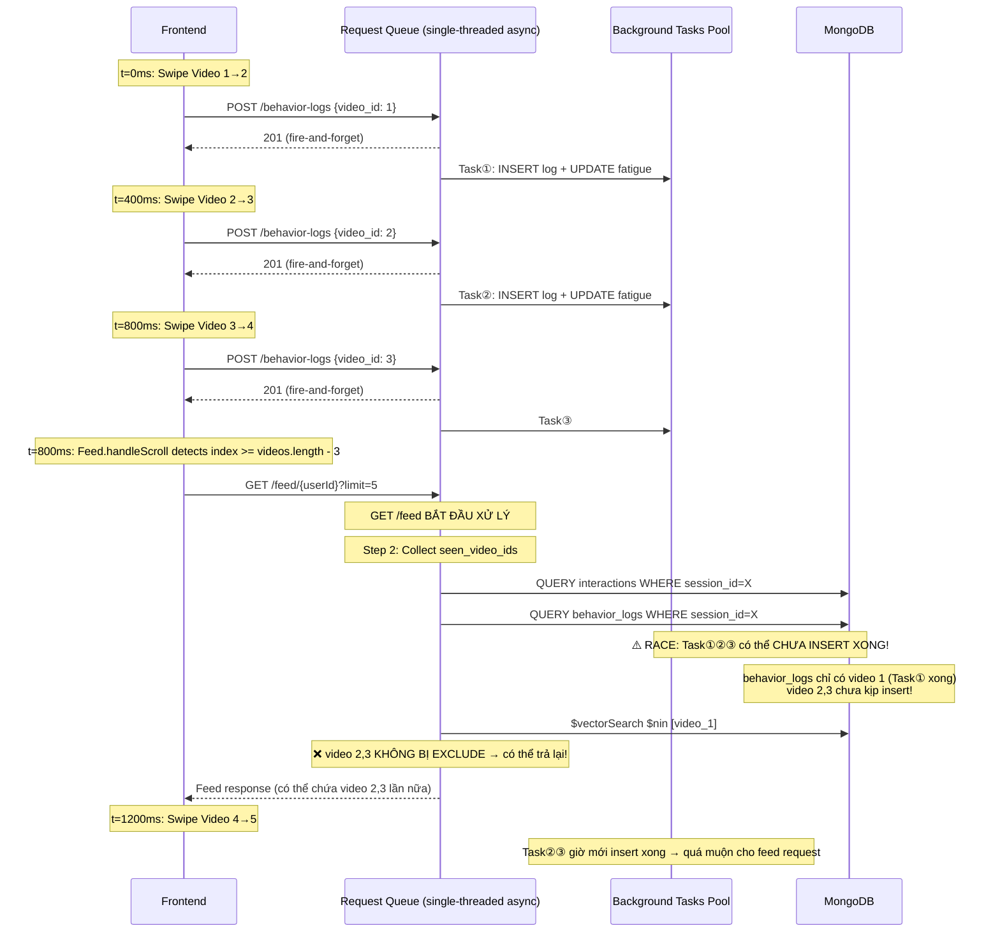
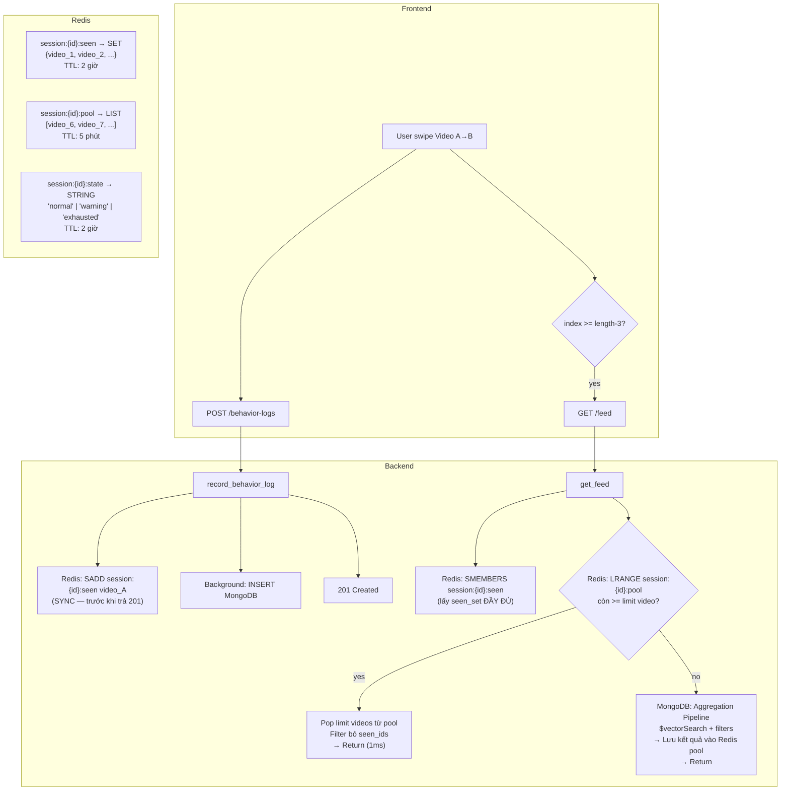

# 🔍 Race Condition Deep-Dive & Redis Feed Cache Proposal

**Ngày:** 25/05/2026  
**Scope:** Phân tích chi tiết race condition giữa behavior log và feed pipeline + Đề xuất Redis caching layer

---

## 📋 Mục lục

1. [Race Condition: Giải thích từng bước](#1-race-condition-giải-thích-từng-bước)
2. [Bạn đoán đúng: Root cause thực sự](#2-bạn-đoán-đúng-root-cause-thực-sự)
3. [Redis Feed Cache Proposal: Đánh giá](#3-redis-feed-cache-proposal-đánh-giá)
4. [Kiến trúc đề xuất cuối cùng](#4-kiến-trúc-đề-xuất-cuối-cùng)
5. [Quyết định: Có nên làm hay không?](#5-quyết-định-có-nên-làm-hay-không)

---

## 1. Race Condition: Giải thích từng bước

### Luồng hiện tại khi user lướt video

Hãy trace **chính xác** code hiện tại khi user lướt từ Video A → Video B:



> [!IMPORTANT]  
> **Điểm mấu chốt ở dòng L297-298 trong [interaction_service.py](file:///home/nhphat/Personal/WorkSpace/Hackathon/backend/app/services/interaction_service.py#L297-L298):**
> ```python
> # Fire and forget the actual insertion and metric updates
> asyncio.create_task(self._process_behavior_log_background(data, log_id, now))
> 
> # Return immediately to client to prevent blocking
> return BehaviorLogResponse(...)  # ← TRƯỚC KHI DB INSERT XONG!
> ```
> 
> API trả về 201 **trước** khi behavior log thực sự được insert vào MongoDB.
> Đây là **fire-and-forget pattern** — tối ưu cho latency nhưng **gây race condition với dedup**.

---

### Kịch bản nguy hiểm: User lướt cực nhanh qua 5 video

Bây giờ trace kịch bản thực tế: user lướt nhanh qua 5 video trong 2 giây:



### Tại sao race condition xảy ra?

```
Timeline:
─────────────────────────────────────────────────────────────────
t=0ms     t=400ms    t=800ms    t=800ms      t=1000ms   t=1500ms
│         │          │          │             │          │
POST      POST       POST       GET /feed    Task①     Task②③
log(v1)   log(v2)    log(v3)    STARTS       done      done
│         │          │          │             │          │
▼         ▼          ▼          ▼             ▼          ▼
201 OK    201 OK     201 OK     Query DB      INSERT    INSERT
(no DB    (no DB     (no DB     for seen      log(v1)   log(v2,v3)
 write)    write)     write)    video_ids     to DB     to DB
                                │
                                ▼
                                seen_set = {v1}  ← THIẾU v2, v3!
                                $nin excludes chỉ v1
                                → Có thể trả lại v2, v3 🔴
```

**Vậy bạn đoán đúng 100%!**

---

## 2. Bạn đoán đúng: Root cause thực sự

Tổng hợp lại những gì bạn đã nhận ra:

### ✅ Đúng #1: "Lướt nhanh quá không kịp lưu behavior log"
```
record_behavior_log() trả về 201 TRƯỚC KHI insert DB
→ GET /feed chạy → query behavior_logs → THIẾU logs chưa insert
→ $nin filter KHÔNG exclude video đã xem
→ Feed có thể trả lại video đã lướt qua
```

### ✅ Đúng #2: "BE đang cần consume tất cả request behavior log rồi mới đến get feed"
```
Không hẳn "mới đến" — chúng chạy SONG SONG.
Nhưng bản chất đúng: background tasks chưa persist xong
→ GET /feed query ra seen_set không đầy đủ.
```

### ✅ Đúng #3: "Hết video, đợi get feed nhưng be đang lưu behavior log"
```
FE trigger onLoadMore() → mutateFeed() → GET /feed
Nhưng 2-3 background tasks vẫn đang chạy
→ Feed trả về video trùng hoặc không optimal
```

### Bao nhiêu lần xảy ra trong thực tế?

| Tốc độ lướt | Khoảng cách swipe | Xác suất race |
|---|---|---|
| Chậm (>3s/video) | Background task ~50-100ms | **~0%** — tasks xong trước feed request |
| Bình thường (1-3s) | Background task ~50-100ms | **~5%** — hiếm khi trùng timing |
| Nhanh (<1s, doomscroll) | Tasks chồng chất | **~30-50%** — nhiều tasks pending khi feed fires |

---

## 3. Redis Feed Cache Proposal: Đánh giá

### Ý tưởng của bạn (rephrase chính xác)

```
1. Khi GET /feed trả về 10 video → LƯU vào Redis (key = session_id)
2. Mỗi lần GET /feed tiếp theo → CHECK Redis trước:
   - Nếu Redis có đủ 5 video chưa xem → trả về từ Redis (nhanh, không chờ DB)
   - Nếu Redis hết/thiếu → xuống aggregation pipeline lấy mới
3. Redis đóng vai trò "pre-fetched pool" (lazy fetch)
4. Có TTL để tránh data cũ
5. Behavior log ghi seen_ids vào Redis luôn (real-time, không chờ MongoDB)
```

### Đánh giá: ✅ Ý tưởng rất tốt, nhưng cần tinh chỉnh

#### Điểm mạnh:
- **Giải quyết race condition**: Redis write là synchronous (trong context async Python), ~1ms — behavior log ghi seen_id vào Redis **trước khi** trả 201 → GET /feed đọc Redis → seen_set luôn đầy đủ.
- **Giảm load MongoDB**: Feed query aggregation pipeline nặng (~50-200ms). Redis read ~1ms.
- **Pre-fetch**: Lấy dư video → serve instant, fetch thêm khi cần.

#### Điểm yếu cần giải quyết:
- **Thêm dependency**: Redis cần deploy + maintain.
- **Cache invalidation**: Nếu fatigue_state thay đổi (normal → exhausted), cache phải bị invalidate vì pipeline cần trả video khác hoàn toàn.
- **TTL**: Quá ngắn → miss cache liên tục. Quá dài → video cũ/không cá nhân hóa.

---

## 4. Kiến trúc đề xuất cuối cùng

### Option A: Redis Full Cache (như bạn đề xuất) — Phức tạp nhưng tối ưu



**Redis Keys:**
| Key | Type | Nội dung | TTL |
|-----|------|---------|-----|
| `session:{id}:seen` | SET | Tất cả video_id đã xem | 2 giờ (= session max) |
| `session:{id}:pool` | LIST | Video đã fetch nhưng chưa serve cho FE | 5 phút |
| `session:{id}:state` | STRING | `adaptive_state` hiện tại | 2 giờ |

**Luồng hoạt động:**

```python
# ── Trong record_behavior_log (TRƯỚC KHI trả 201) ──
async def record_behavior_log(self, data):
    log_id = str(ObjectId())
    now = datetime.utcnow()
    
    # ✅ SYNC write vào Redis — chỉ ~1ms, giải quyết race condition
    await redis.sadd(f"session:{data.session_id}:seen", data.video_id)
    
    # Fire-and-forget MongoDB insert (vẫn giữ pattern cũ)
    asyncio.create_task(self._process_behavior_log_background(data, log_id, now))
    
    return BehaviorLogResponse(id=log_id, ...)

# ── Trong get_feed ──
async def get_feed(self, user_id, limit=5):
    # 1. Lấy seen_set TỪ REDIS (luôn đầy đủ, không race)
    seen_set = await redis.smembers(f"session:{session_id}:seen")
    
    # 2. Check state — nếu state thay đổi, invalidate pool
    cached_state = await redis.get(f"session:{session_id}:state")
    current_state = active_session.get("adaptive_state", "normal")
    if cached_state != current_state:
        await redis.delete(f"session:{session_id}:pool")
        await redis.set(f"session:{session_id}:state", current_state, ex=7200)
    
    # 3. Try lấy từ pool trước (lazy fetch)
    pool_videos = await redis.lrange(f"session:{session_id}:pool", 0, limit * 2)
    unseen = [v for v in pool_videos if v["id"] not in seen_set]
    
    if len(unseen) >= limit:
        # ✅ Cache HIT — trả về từ Redis (1ms), không cần query MongoDB
        result = unseen[:limit]
        # Xóa những video đã serve khỏi pool
        # (hoặc dùng index tracking)
        return result
    
    # 4. Cache MISS — chạy aggregation pipeline
    docs = await self._video_repo.vector_search(...)
    
    # 5. Lưu dư vào pool cho request tiếp theo
    extra_docs = docs[limit:]  # Nếu fetch 10 serve 5 → cache 5
    if extra_docs:
        await redis.rpush(f"session:{session_id}:pool", *extra_docs)
        await redis.expire(f"session:{session_id}:pool", 300)  # 5 phút TTL
    
    return docs[:limit]
```

---

### Option B: Redis Seen-Set Only (Đơn giản hơn) — Khuyến nghị cho Hackathon

Nếu không muốn thêm complexity của pool caching, chỉ cần **giải quyết race condition**:

```python
# ── Chỉ thêm 1 dòng vào record_behavior_log ──
async def record_behavior_log(self, data):
    log_id = str(ObjectId())
    now = datetime.utcnow()
    
    # ✅ FIX RACE: Ghi seen_id vào Redis TRƯỚC KHI trả response
    await redis.sadd(f"session:{data.session_id}:seen", data.video_id)
    await redis.expire(f"session:{data.session_id}:seen", 7200)  # 2h TTL
    
    asyncio.create_task(self._process_behavior_log_background(data, log_id, now))
    return BehaviorLogResponse(...)

# ── Sửa get_feed: đọc seen_set từ Redis thay vì query MongoDB ──
async def get_feed(self, user_id, limit=5):
    ...
    # THAY THẾ query MongoDB cho seen_ids:
    # OLD: seen_video_ids = await self._interaction_repo.find_video_ids_in_session(session_id)
    # OLD: behavior_docs = await self._log_repo.find_many(...)
    
    # NEW: Đọc từ Redis (luôn up-to-date, ~1ms)
    seen_set = await redis.smembers(f"session:{session_id}:seen")
    
    # Vẫn chạy aggregation pipeline bình thường nhưng với seen_set đầy đủ
    ...
```

**So sánh 2 options:**

| Tiêu chí | Option A (Full Cache) | Option B (Seen-Set Only) |
|---|---|---|
| Giải quyết race condition | ✅ | ✅ |
| Giảm feed latency | ✅ (cache hit ~1ms) | ❌ (vẫn query MongoDB) |
| Complexity | 🔴 Cao (pool management, invalidation) | 🟢 Thấp (~10 dòng code) |
| Phù hợp Hackathon | ❌ Quá phức tạp | ✅ Vừa đủ |
| Pre-fetch/Lazy fetch | ✅ | ❌ |

---

### Option C: Không dùng Redis — Sửa bằng cách bỏ fire-and-forget

Giải pháp đơn giản nhất nếu không muốn thêm Redis dependency:

```python
# ── Sửa record_behavior_log: AWAIT thay vì fire-and-forget ──
async def record_behavior_log(self, data):
    now = datetime.utcnow()
    log_id = str(ObjectId())
    
    # ✅ AWAIT insert — đảm bảo DB có data TRƯỚC KHI trả response
    await self._process_behavior_log_background(data, log_id, now)
    #     ↑ bỏ asyncio.create_task, await trực tiếp
    
    return BehaviorLogResponse(...)
```

**Trade-off:**
- ✅ Race condition biến mất hoàn toàn
- ❌ API latency tăng ~50-100ms mỗi behavior log (phải chờ MongoDB insert + fatigue calc)
- ❌ Khi doomscroll nhanh, FE phải chờ mỗi POST xong mới scroll mượt

---

## 5. Quyết định: Có nên làm hay không?

### Khuyến nghị cho Hackathon: **Option B** (Redis Seen-Set Only)

**Lý do:**
1. **10 dòng code** — thêm Redis SADD trong behavior log + SMEMBERS trong get_feed
2. **Fix đúng root cause** — seen_set luôn real-time, không race
3. **Bonus latency** — bỏ 2 MongoDB queries (interactions + behavior_logs) cho seen_ids → dùng Redis 1ms
4. **Không cần pool complexity** — aggregation pipeline vẫn chạy, chỉ đảm bảo filter đúng
5. **TTL đơn giản** — `EXPIRE 7200` (2 giờ = max session lifetime)

### Nếu có thời gian thêm: Nâng lên **Option A** (Full Cache)

Thêm pre-fetch pool để:
- Feed response instant (~1ms vs ~100-200ms)
- Giảm load MongoDB Atlas (quan trọng ở free tier)
- Demo "blazing fast" trải nghiệm mượt mà

### Nếu không muốn thêm Redis: **Option C** (bỏ fire-and-forget)

Đổi `asyncio.create_task()` thành `await` trong behavior log — đơn giản nhất nhưng tăng latency.

---

## Tổng kết bảng so sánh

| | Option A | Option B | Option C |
|---|---|---|---|
| **Giải pháp** | Redis Full Cache | Redis Seen-Set | Bỏ fire-and-forget |
| **Fix race** | ✅ | ✅ | ✅ |
| **Feed latency** | ~1ms (cache hit) | ~100ms (pipeline) | ~100ms (pipeline) |
| **BehaviorLog latency** | ~2ms (Redis SADD) | ~2ms (Redis SADD) | ~100ms (await DB) |
| **Code changes** | ~80 dòng | ~10 dòng | ~3 dòng |
| **New dependency** | Redis | Redis | Không |
| **Khuyến nghị** | Production | **Hackathon** ⭐ | MVP/Demo |
