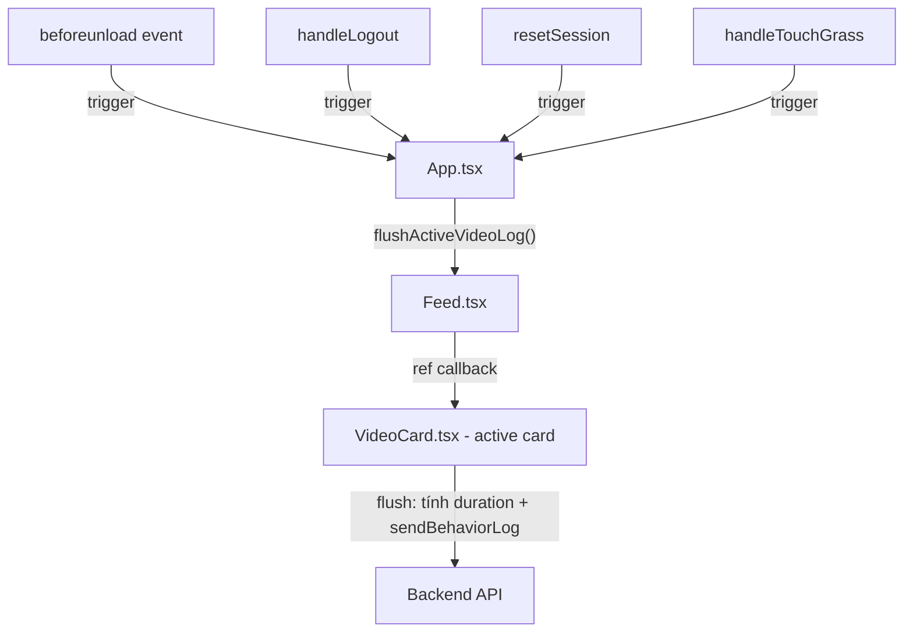

# 🔧 Fix: Video Cuối Cùng Đang Xem Bị Miss Behavior Log

## 📋 Phân Tích Bug

### Luồng hiện tại (có bug)

```
User xem 5 videos:
  Video 1 → lướt qua → cleanup fires → ✅ LOG (duration = 10s)
  Video 2 → lướt qua → cleanup fires → ✅ LOG (duration = 5s)
  Video 3 → lướt qua → cleanup fires → ✅ LOG (duration = 8s)
  Video 4 → lướt qua → cleanup fires → ✅ LOG (duration = 3s)
  Video 5 → ĐANG XEM → user đóng tab / logout / navigate away
                      → cleanup MAY hoặc MAY NOT fire
                      → ❌ MISS LOG
```

### Nguyên nhân gốc

Behavior log chỉ được bắn trong `useEffect` cleanup của `VideoCard.tsx` — cleanup chỉ chạy khi:
1. `isActive` flip `true → false` (user lướt qua video khác)
2. Component unmount

**Vấn đề:** Khi user đóng tab/navigate away, React **không đảm bảo** cleanup effects chạy kịp. Browser kill process trước khi async `sendBehaviorLog()` hoàn thành.

### Video đầu tiên

Video đầu tiên (`index=0`) **KHÔNG bị miss** vì khi user lướt xuống video 2, `isActive` của video 1 flip `false` → cleanup fires → log OK.

**Chỉ video cuối cùng đang active bị miss.**

---

## 🎯 Giải Pháp: Flush Log Trước Khi Mất Context

### Ý tưởng cốt lõi

> VideoCard đã biết cách log (cleanup logic). Ta chỉ cần **đảm bảo cleanup chạy** trước khi mất context (đóng tab, logout, end session).

### Cách tiếp cận: Expose "flush" function từ VideoCard → Feed → App



---

## 📝 Implementation Plan

### Phase 1: VideoCard expose `flushLog` via `useImperativeHandle`

**File:** `frontend/src/components/VideoCard.tsx`

**Thay đổi:**
1. Wrap component bằng `React.forwardRef`
2. Dùng `useImperativeHandle` để expose method `flushLog()`
3. `flushLog()` chạy **cùng logic** với cleanup hiện tại (tính duration, gọi sendBehaviorLog) nhưng **không reset** `activeStartTimeRef` (để cleanup vẫn chạy được nếu cần — idempotent via guard)

```tsx
// VideoCard.tsx

// 1. Thêm import
import React, { ..., forwardRef, useImperativeHandle } from 'react';

// 2. Thêm ref handle interface
export interface VideoCardHandle {
  flushLog: () => void;
}

// 3. Wrap component
export const VideoCard = forwardRef<VideoCardHandle, VideoCardProps>(({
  // ...props
}, ref) => {

  // 4. Helper function: extract log logic ra khỏi cleanup
  const flushBehaviorLog = () => {
    if (activeStartTimeRef.current === null) return; // Không có gì để flush
    
    const duration = (Date.now() - activeStartTimeRef.current) / 1000;
    activeStartTimeRef.current = null; // Mark as flushed (prevent double-log)

    const params = logParamsRef.current;
    if (params.userId && params.sessionId && activeSessionIdRef.current === params.sessionId) {
      if (duration > 0.1) {
        const wasInteracted = params.isLiked || params.hasCommented || replayCountRef.current > 0;
        sendBehaviorLog(
          params.videoId, params.topic, params.userId, params.sessionId,
          params.swipeSpeed, duration, wasInteracted
        ).then(() => {
          onRefreshSessionStats();
        });
      }
    }
  };

  // 5. Expose flushLog via ref
  useImperativeHandle(ref, () => ({
    flushLog: flushBehaviorLog
  }));

  // 6. Cleanup effect reuse cùng function
  useEffect(() => {
    if (isActive && isInWindow) {
      // ...existing activation logic (unchanged)
    } else if (!isActive) {
      // ...existing pause logic (unchanged)
    }

    return () => {
      flushBehaviorLog(); // ← Reuse cùng function
    };
  }, [isActive, isInWindow]);

  // ...rest unchanged
});
```

> [!IMPORTANT]
> `activeStartTimeRef.current = null` trong `flushBehaviorLog` là guard idempotent: nếu flush đã chạy, cleanup sẽ thấy `null` và skip → **không bao giờ double-log**.

---

### Phase 2: Feed track active VideoCard ref

**File:** `frontend/src/components/Feed.tsx`

**Thay đổi:**
1. Thêm `ref` cho active VideoCard
2. Expose `flushActiveLog` method cho parent (App)

```tsx
// Feed.tsx

import { ..., forwardRef, useImperativeHandle } from 'react';
import { VideoCard, VideoCardHandle } from './VideoCard';

export interface FeedHandle {
  flushActiveLog: () => void;
}

export const Feed = forwardRef<FeedHandle, FeedProps>(({
  videos, userId, sessionId, ...props
}, ref) => {

  // Ref map: track ref cho MỖI VideoCard
  const cardRefsMap = useRef<Map<string, React.RefObject<VideoCardHandle>>>(new Map());

  // Helper: get hoặc tạo ref cho video id
  const getCardRef = (videoId: string) => {
    if (!cardRefsMap.current.has(videoId)) {
      cardRefsMap.current.set(videoId, React.createRef<VideoCardHandle>());
    }
    return cardRefsMap.current.get(videoId)!;
  };

  // Expose flush method
  useImperativeHandle(ref, () => ({
    flushActiveLog: () => {
      // Flush log cho video đang active
      const activeVideo = videos[activeIndex];
      if (activeVideo) {
        const activeRef = cardRefsMap.current.get(activeVideo.id);
        activeRef?.current?.flushLog();
      }
    }
  }));

  return (
    <div ref={containerRef} onScroll={handleScroll} ...>
      {videos.map((video, index) => (
        <VideoCard
          key={video.id}
          ref={getCardRef(video.id)}
          // ...existing props
        />
      ))}
    </div>
  );
});
```

---

### Phase 3: App gọi `flushActiveLog` trước khi mất context

**File:** `frontend/src/App.tsx`

**Thay đổi:**

```tsx
// App.tsx

import { Feed, FeedHandle } from './components/Feed';

function App() {
  const feedRef = useRef<FeedHandle>(null);

  // 1. beforeunload: flush khi đóng tab
  useEffect(() => {
    const handleBeforeUnload = () => {
      feedRef.current?.flushActiveLog();
    };
    window.addEventListener('beforeunload', handleBeforeUnload);
    return () => window.removeEventListener('beforeunload', handleBeforeUnload);
  }, []);

  // 2. visibilitychange: flush khi chuyển tab (mobile đặc biệt)
  useEffect(() => {
    const handleVisibilityChange = () => {
      if (document.visibilityState === 'hidden') {
        feedRef.current?.flushActiveLog();
      }
    };
    document.addEventListener('visibilitychange', handleVisibilityChange);
    return () => document.removeEventListener('visibilitychange', handleVisibilityChange);
  }, []);

  // 3. Trong handleLogout — flush TRƯỚC khi endSession
  const handleLogout = async () => {
    feedRef.current?.flushActiveLog(); // ← Flush trước
    disconnectSessionWS();
    if (sessionId) {
      try { await endSession(sessionId); } catch (error) { ... }
    }
    // ...rest
  };

  // 4. Trong resetSession — flush TRƯỚC khi endSession
  const resetSession = async () => {
    feedRef.current?.flushActiveLog(); // ← Flush trước
    if (user && sessionId) {
      disconnectSessionWS();
      await endSession(sessionId);
      // ...rest
    }
  };

  // 5. Trong handleTouchGrass — flush TRƯỚC khi handleLogout
  const handleTouchGrass = async () => {
    feedRef.current?.flushActiveLog(); // ← Flush trước
    setShowTouchGrassModal(false);
    // ...rest
    await handleLogout();
  };

  // 6. Truyền ref vào Feed
  return (
    // ...
    <Feed
      ref={feedRef}
      videos={feedVideos}
      // ...existing props
    />
  );
}
```

---

## 📋 Checklist

| # | Task | File | Trạng thái |
|---|------|------|-----------|
| 1 | Extract `flushBehaviorLog` helper function | `VideoCard.tsx` | ⬜ |
| 2 | Wrap VideoCard bằng `forwardRef` | `VideoCard.tsx` | ⬜ |
| 3 | Expose `flushLog` via `useImperativeHandle` | `VideoCard.tsx` | ⬜ |
| 4 | Cleanup effect reuse `flushBehaviorLog` | `VideoCard.tsx` | ⬜ |
| 5 | Feed wrap `forwardRef` + expose `flushActiveLog` | `Feed.tsx` | ⬜ |
| 6 | Feed track active card ref | `Feed.tsx` | ⬜ |
| 7 | App: `beforeunload` listener | `App.tsx` | ⬜ |
| 8 | App: `visibilitychange` listener | `App.tsx` | ⬜ |
| 9 | App: flush trước `handleLogout` | `App.tsx` | ⬜ |
| 10 | App: flush trước `resetSession` | `App.tsx` | ⬜ |
| 11 | App: flush trước `handleTouchGrass` | `App.tsx` | ⬜ |
| 12 | App: truyền `ref={feedRef}` vào Feed | `App.tsx` | ⬜ |

---

## 🧪 Test Cases

### Test 1: Đóng tab khi đang xem video
- **Hành động:** Xem video 3, đóng tab browser
- **Kỳ vọng:** Video 3 có behavior_log với duration thực tế

### Test 2: Logout khi đang xem video
- **Hành động:** Xem video 5, nhấn Logout
- **Kỳ vọng:** Video 5 có behavior_log trước khi session kết thúc

### Test 3: Reset Session khi đang xem video
- **Hành động:** Xem video 2, nhấn "Reset Trạng Thái"
- **Kỳ vọng:** Video 2 có behavior_log trước khi session cũ kết thúc

### Test 4: Touch Grass modal force quit
- **Hành động:** Fatigue cao → modal hiện → nhấn "Đi Ra Ngoài"
- **Kỳ vọng:** Video đang xem có behavior_log

### Test 5: Không double-log khi lướt bình thường
- **Hành động:** Xem video 1 → lướt qua video 2 → lướt qua video 3
- **Kỳ vọng:** Mỗi video chỉ có **đúng 1** behavior_log (flush idempotent)

---

## ⚠️ Edge Cases

| Case | Xử lý |
|------|--------|
| `beforeunload` + cleanup cùng fire | `activeStartTimeRef = null` guard → chỉ log 1 lần |
| `visibilitychange` khi user chỉ alt-tab | Log được bắn, nhưng `activeStartTimeRef` reset → khi user quay lại, timer bắt đầu lại từ 0. **Acceptable** vì capture đúng thời gian xem thực tế. |
| `sendBehaviorLog` là async, `beforeunload` có thể bị kill | Dùng `navigator.sendBeacon` nếu cần (upgrade sau). Hiện tại `fetch` với `keepalive: true` cũng đủ cho hầu hết browser. |
| Video đầu tiên (index=0) | Không bị ảnh hưởng — video đầu luôn log khi lướt xuống video 2 |
