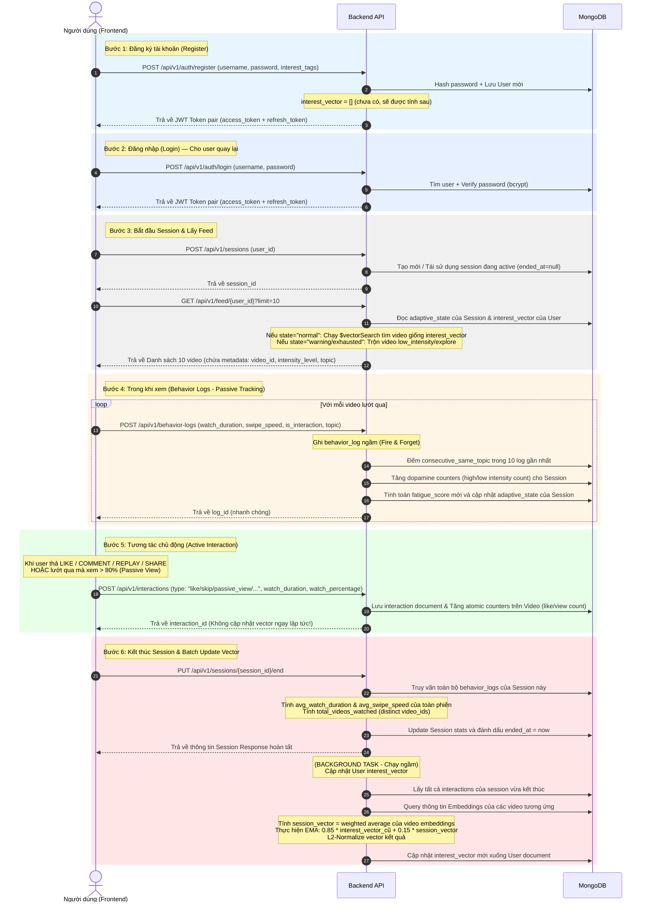

# User Lifecycle & Vector Flow: Hướng dẫn tích hợp cho Frontend

Tài liệu này mô tả chi tiết toàn bộ luồng đời (lifecycle) của người dùng từ lúc Onboarding (đăng ký), tiêu thụ Feed (gợi ý video), ghi nhận hành vi lướt video, ghi nhận tương tác, cho đến bước kết thúc Session và cập nhật hồ sơ sở thích của người dùng (`interest_vector`).

---

## Sơ đồ tổng quan luồng dữ liệu (Data Flow Diagram)



---

## Mô tả chi tiết từng API

---

### API 1: Đăng ký tài khoản (Register)

| | |
|---|---|
| **Method** | `POST` |
| **URL** | `/api/v1/auth/register` |
| **Mục đích** | Tạo tài khoản mới với mật khẩu + Trả về JWT Token |

**Request Body (Input):**
```json
{
  "username": "tgkhanh_dev",
  "email": "khanh@example.com",
  "password": "securePass123",
  "interest_tags": ["coding", "football"]
}
```
| Field | Type | Bắt buộc | Mô tả |
|---|---|---|---|
| `username` | string | ✅ | Tên hiển thị, phải unique, 3-50 ký tự |
| `email` | string | ❌ | Email người dùng |
| `password` | string | ✅ | Mật khẩu plain text, 6-128 ký tự (sẽ được hash bằng bcrypt) |
| `interest_tags` | string[] | ✅ | Đúng 2 tags user chọn trong onboarding screen |

**Response Body (Output) — HTTP 201:**
```json
{
  "access_token": "eyJhbGciOiJIUzI1NiIs...",
  "refresh_token": "eyJhbGciOiJIUzI1NiIs...",
  "token_type": "bearer",
  "expires_in": 1800
}
```
| Field | Type | Mô tả |
|---|---|---|
| `access_token` | string | JWT access token — dùng để gọi các API khác |
| `refresh_token` | string | JWT refresh token — dùng để lấy access token mới khi hết hạn |
| `token_type` | string | Luôn là `"bearer"` |
| `expires_in` | int | Thời gian sống của access_token (giây) |

> [!NOTE]
> Sau khi register, `interest_vector` của user vẫn là rỗng `[]`. Vector sẽ được tính toán và cập nhật sau khi user bắt đầu tương tác với video trong các session tiếp theo.

---

### API 2: Đăng nhập (Login)

| | |
|---|---|
| **Method** | `POST` |
| **URL** | `/api/v1/auth/login` |
| **Mục đích** | Xác thực user quay lại và cấp JWT Token mới |

**Request Body (Input):**
```json
{
  "username": "tgkhanh_dev",
  "password": "securePass123"
}
```
| Field | Type | Bắt buộc | Mô tả |
|---|---|---|---|
| `username` | string | ✅ | Tên đăng nhập |
| `password` | string | ✅ | Mật khẩu plain text |

**Response Body (Output) — HTTP 200:**
```json
{
  "access_token": "eyJhbGciOiJIUzI1NiIs...",
  "refresh_token": "eyJhbGciOiJIUzI1NiIs...",
  "token_type": "bearer",
  "expires_in": 1800
}
```
| Field | Type | Mô tả |
|---|---|---|
| `access_token` | string | JWT access token mới |
| `refresh_token` | string | JWT refresh token mới |
| `expires_in` | int | TTL của access_token (giây) |

> [!IMPORTANT]
> Frontend cần decode JWT payload (`sub` field) để lấy `user_id` sử dụng cho tất cả API tiếp theo (Start Session, Get Feed, Behavior Logs, Interactions).

---

### API 3: Tạo phiên làm việc (Start Session)


| | |
|---|---|
| **Method** | `POST` |
| **URL** | `/api/v1/sessions` |
| **Mục đích** | Khởi tạo phiên lướt video. Nếu đã có session active thì tái sử dụng |

**Request Body (Input):**
```json
{
  "user_id": "6a1154bd8525c41e5d8dcfb7"
}
```
| Field | Type | Bắt buộc | Mô tả |
|---|---|---|---|
| `user_id` | string | ✅ | ID của user (từ bước Onboarding) |

**Response Body (Output) — HTTP 201:**
```json
{
  "id": "6a116e69f50cb87dd3b1e3e9",
  "user_id": "6a1154bd8525c41e5d8dcfb7",
  "started_at": "2026-05-23T09:10:00Z",
  "ended_at": null,
  "total_videos_watched": 0,
  "fatigue_score": 0.0,
  "adaptive_state": "normal",
  "high_intensity_count": 0,
  "low_intensity_count": 0,
  "avg_watch_duration": 0.0,
  "avg_swipe_speed": 0.0
}
```
| Field | Type | Mô tả |
|---|---|---|
| `id` | string | Session ID — **lưu lại để dùng cho các API tiếp theo** |
| `ended_at` | datetime \| null | `null` = session đang active |
| `adaptive_state` | string | `"normal"` / `"warning"` / `"exhausted"` — trạng thái mệt mỏi |

> [!IMPORTANT]
> Frontend phải lưu `session_id` vào App State/Context để gửi kèm trong các API Behavior Log và Interaction.

---

### API 4: Lấy Feed cá nhân hóa (Get Personalized Feed)

| | |
|---|---|
| **Method** | `GET` |
| **URL** | `/api/v1/feed/{user_id}?limit=10` |
| **Mục đích** | Lấy danh sách video được gợi ý dựa trên interest_vector & fatigue state |

**Path & Query Parameters (Input):**
| Param | Type | Mặc định | Mô tả |
|---|---|---|---|
| `user_id` | string (path) | — | ID người dùng |
| `limit` | int (query) | 5 | Số video muốn lấy (1-50) |

**Response Body (Output) — HTTP 200:**
```json
[
  {
    "id": "6a1038b30fbae60014a2c997",
    "title": "10 Coding Memes Only Devs Understand 😂",
    "description": "Relatable content for programmers...",
    "url": "https://cdn.example.com/video-001.mp4",
    "thumbnail_url": "https://cdn.example.com/thumb-001.jpg",
    "tags": ["coding", "meme", "programmer"],
    "category": "entertainment",
    "intensity_level": "high",
    "view_count": 3200,
    "like_count": 540,
    "comment_count": 87,
    "trending_score": 4075.0,
    "creator_id": "creator_devjokes",
    "has_embedding": true,
    "created_at": "2026-05-20T10:00:00Z",
    "updated_at": "2026-05-23T09:15:00Z"
  }
]
```

> [!TIP]
> Frontend cần lưu trữ sẵn `tags[0]` (dùng làm `topic`) và `intensity_level` của mỗi video để gửi kèm trong Behavior Log API ở bước tiếp theo.

---

### API 5: Ghi nhận hành vi thụ động (Behavior Log)

| | |
|---|---|
| **Method** | `POST` |
| **URL** | `/api/v1/behavior-logs` |
| **Mục đích** | Ghi lại hành vi lướt video (mỗi video 1 log). Phục vụ Fatigue Engine |

**Request Body (Input):**
```json
{
  "user_id": "6a1154bd8525c41e5d8dcfb7",
  "session_id": "6a116e69f50cb87dd3b1e3e9",
  "video_id": "6a1038b30fbae60014a2c997",
  "swipe_speed": 850.0,
  "watch_duration": 5.2,
  "is_interaction": false,
  "topic": "coding"
}
```
| Field | Type | Bắt buộc | Mô tả |
|---|---|---|---|
| `user_id` | string | ✅ | ID người dùng |
| `session_id` | string | ✅ | ID session hiện tại |
| `video_id` | string | ✅ | ID video vừa lướt qua |
| `swipe_speed` | float | ❌ | Tốc độ vuốt (px/giây). Default: 0.0 |
| `watch_duration` | float | ❌ | Số giây đã xem video. Default: 0.0 |
| `is_interaction` | bool | ❌ | `true` nếu user có like/comment/replay tại video này. Default: `false` |
| `topic` | string | ✅ | Chủ đề chính của video (lấy từ `tags[0]`) |

**Response Body (Output) — HTTP 201:**
```json
{
  "id": "6a117100f50cb87dd3b1e3ee",
  "user_id": "6a1154bd8525c41e5d8dcfb7",
  "session_id": "6a116e69f50cb87dd3b1e3e9",
  "video_id": "6a1038b30fbae60014a2c997",
  "timestamp": "2026-05-23T09:20:00Z",
  "swipe_speed": 850.0,
  "watch_duration": 5.2,
  "is_interaction": false,
  "topic": "coding",
  "consecutive_same_topic": 3
}
```
| Field | Type | Mô tả |
|---|---|---|
| `consecutive_same_topic` | int | Backend tự tính: số video cùng topic liên tiếp gần nhất (dùng cho fatigue) |

> [!IMPORTANT]
> API này **bắt buộc** phải gọi cho **mọi video** user lướt qua (kể cả chỉ xem 1 giây rồi vuốt). Nếu không gọi, Fatigue Engine sẽ không hoạt động.

---

### API 6: Ghi nhận tương tác chủ động (Interaction)

| | |
|---|---|
| **Method** | `POST` |
| **URL** | `/api/v1/interactions` |
| **Mục đích** | Ghi nhận sự kiện tương tác có chủ đích (like/skip/comment/share/passive_view) |

**Request Body (Input):**
```json
{
  "user_id": "6a1154bd8525c41e5d8dcfb7",
  "video_id": "6a1038b30fbae60014a2c997",
  "session_id": "6a116e69f50cb87dd3b1e3e9",
  "type": "like",
  "watch_duration": 28.5,
  "watch_percentage": 0.95,
  "swipe_speed": 0.0,
  "replay_count": 0
}
```
| Field | Type | Bắt buộc | Mô tả |
|---|---|---|---|
| `user_id` | string | ✅ | ID người dùng |
| `video_id` | string | ✅ | ID video tương tác |
| `session_id` | string | ✅ | ID session hiện tại |
| `type` | string | ✅ | Loại tương tác: `"like"`, `"skip"`, `"comment"`, `"replay"`, `"share"`, `"passive_view"` |
| `watch_duration` | float | ❌ | Thời gian xem (giây). Default: 0.0 |
| `watch_percentage` | float | ❌ | Tỉ lệ đã xem (0.0 → 1.0). Default: 0.0 |
| `swipe_speed` | float | ❌ | Tốc độ vuốt (px/giây). Default: 0.0 |
| `replay_count` | int | ❌ | Số lần xem lại. Default: 0 |

**Khi nào gửi type nào:**
| Hành vi người dùng | `type` gửi lên | Trọng số Vector |
|---|---|---|
| Bấm nút ❤️ Like | `"like"` | +1.0 (Mạnh nhất) |
| Xem lại video (Replay) | `"replay"` | +0.8 |
| Viết bình luận | `"comment"` | +0.6 |
| Chia sẻ video | `"share"` | +0.5 |
| Xem > 80% thời lượng mà không bấm gì | `"passive_view"` | +0.2 (Nhẹ) |
| Vuốt qua nhanh (Skip) | `"skip"` | -0.3 (Âm) |

**Response Body (Output) — HTTP 201:**
```json
{
  "id": "6a116ef2f50cb87dd3b1e3ea",
  "user_id": "6a1154bd8525c41e5d8dcfb7",
  "video_id": "6a1038b30fbae60014a2c997",
  "session_id": "6a116e69f50cb87dd3b1e3e9",
  "type": "like",
  "watch_duration": 28.5,
  "watch_percentage": 0.95,
  "swipe_speed": 0.0,
  "replay_count": 0,
  "timestamp": "2026-05-23T09:25:00Z"
}
```

> [!NOTE]
> Vector sở thích **KHÔNG** được cập nhật ngay tại bước này. Tất cả interactions chỉ được lưu lại và tổng hợp khi `end_session` được gọi.

---

### API 7: Kết thúc phiên làm việc (End Session)

| | |
|---|---|
| **Method** | `PUT` |
| **URL** | `/api/v1/sessions/{session_id}/end` |
| **Mục đích** | Chốt sổ session + Trigger Batch Update vector sở thích (ngầm) |

**Path Parameters (Input):**
| Param | Type | Mô tả |
|---|---|---|
| `session_id` | string | ID session cần kết thúc |

**Response Body (Output) — HTTP 200:**
```json
{
  "id": "6a116e69f50cb87dd3b1e3e9",
  "user_id": "6a1154bd8525c41e5d8dcfb7",
  "started_at": "2026-05-23T09:10:00Z",
  "ended_at": "2026-05-23T10:30:00Z",
  "total_videos_watched": 42,
  "fatigue_score": 35.5,
  "adaptive_state": "normal",
  "high_intensity_count": 18,
  "low_intensity_count": 24,
  "avg_watch_duration": 15.3,
  "avg_swipe_speed": 320.5
}
```
| Field | Type | Mô tả |
|---|---|---|
| `ended_at` | datetime | Thời điểm kết thúc (không còn null) |
| `total_videos_watched` | int | Tổng video duy nhất đã xem trong phiên (distinct video_ids từ behavior_logs) |
| `avg_watch_duration` | float | Trung bình thời gian xem **toàn bộ phiên** (giây) |
| `avg_swipe_speed` | float | Trung bình tốc độ vuốt **toàn bộ phiên** (px/giây) |

> [!IMPORTANT]
> Sau khi API này trả về 200, Backend sẽ chạy **Background Task** (không chặn response) để tính toán và cập nhật `interest_vector` mới của user dựa trên toàn bộ interactions của phiên vừa kết thúc. Frontend không cần chờ đợi thêm gì.
