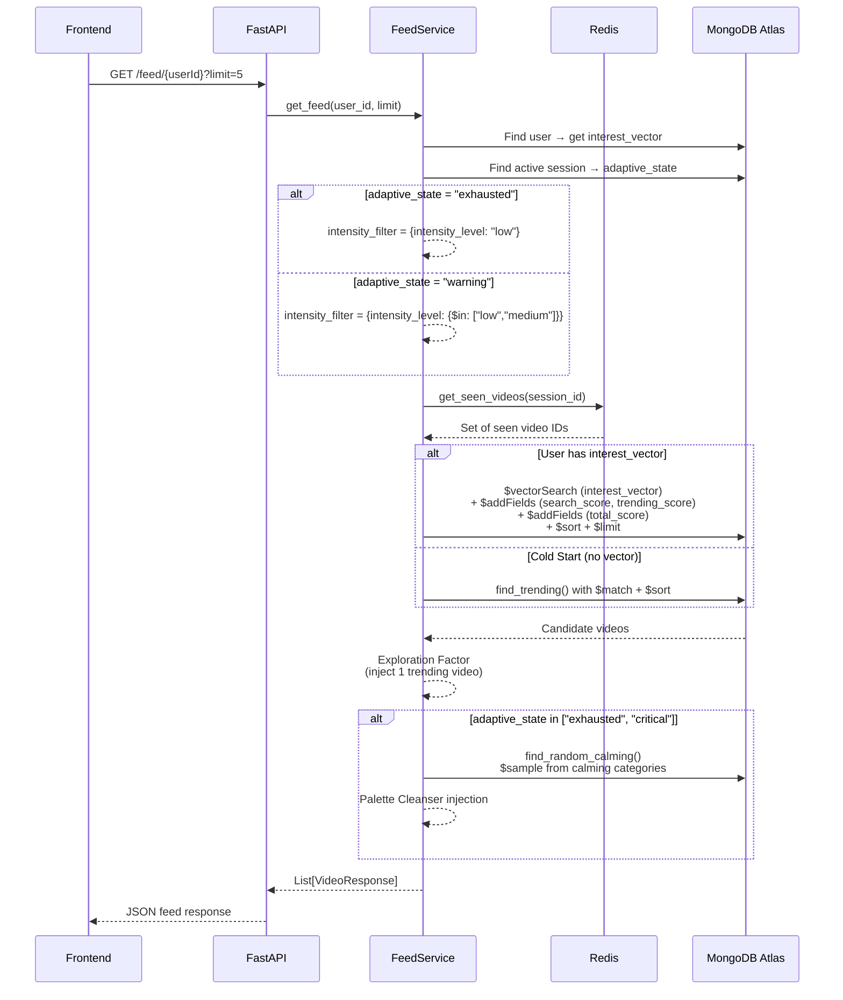
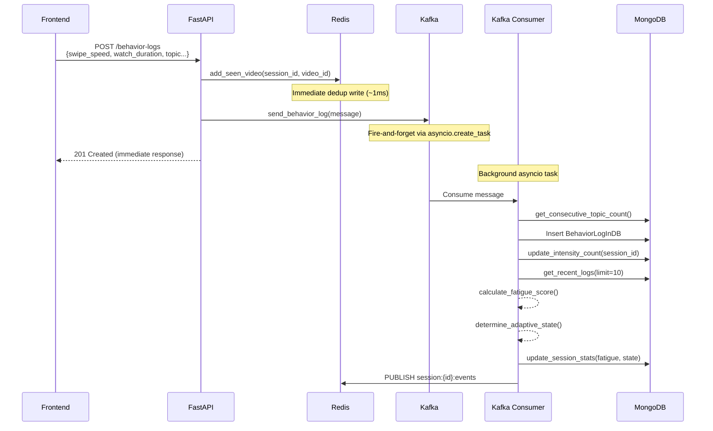
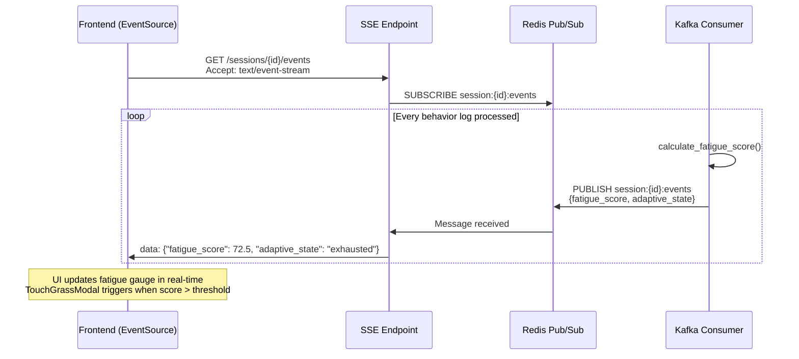
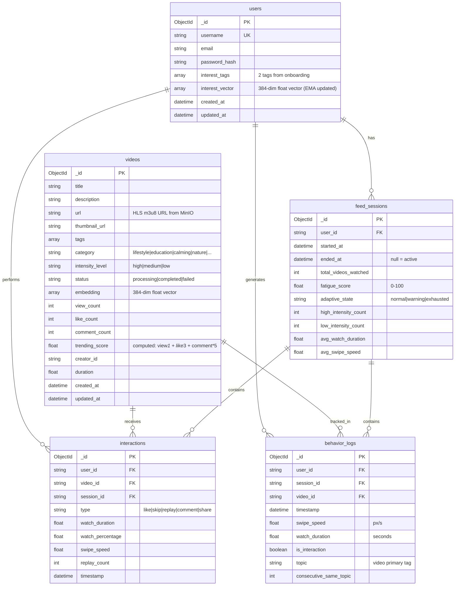

# 🌿 GoTouchGrass — System Architecture

## Tổng quan

**GoTouchGrass** là một **Wellbeing-aware AI Recommendation Engine** cho nền tảng video ngắn. Hệ thống phát hiện doomscrolling theo thời gian thực, tính Fatigue Score, và tự động rebalance feed bằng nội dung chữa lành — sử dụng MongoDB Atlas Vector Search làm lõi.

---

## 1. High-Level Architecture

```mermaid
graph TB
    subgraph CLIENT["🖥️ Frontend — React SPA"]
        FE_APP["App.tsx<br/>Main Orchestrator"]
        FE_FEED["Feed Component<br/>Infinite Scroll"]
        FE_VIDEO["VideoCard<br/>HLS Player (hls.js)"]
        FE_ANALYTICS["Analytics Dashboard<br/>Real-time Fatigue UI"]
        FE_AUTH["Auth Popup<br/>Register / Login"]
        FE_SSE["useSessionSSE Hook<br/>EventSource"]
        FE_WS["useVideoStats Hook<br/>WebSocket"]
        FE_API["API Client (SWR)<br/>REST Calls"]
    end

    subgraph BACKEND["⚙️ Backend — FastAPI (Python)"]
        direction TB
        subgraph CONTROLLERS["Controllers (API Layer)"]
            C_FEED["feed_controller"]
            C_INTERACTION["interaction_controller"]
            C_VIDEO["video_controller"]
            C_AUTH["auth_controller"]
            C_UPLOAD["upload_controller"]
            C_SSE["SSE Endpoint<br/>/sessions/:id/events"]
            C_WS["WebSocket Endpoint<br/>/ws/stats/:session_id"]
        end

        subgraph SERVICES["Services (Business Logic)"]
            S_FEED["FeedService<br/>Personalized Feed Generation"]
            S_INTERACTION["InteractionService<br/>Session + Fatigue + Trending"]
            S_VIDEO["VideoService<br/>CRUD + Embedding"]
            S_AUTH["AuthService<br/>JWT + bcrypt"]
            S_USER["UserService<br/>Onboarding + Vector"]
        end

        subgraph REPOSITORIES["Repositories (Data Access)"]
            R_VIDEO["VideoRepository<br/>Vector Search + Trending"]
            R_USER["UserRepository"]
            R_SESSION["FeedSessionRepository"]
            R_INTERACTION["InteractionRepository"]
            R_BEHAVIOR["BehaviorLogRepository"]
            R_REDIS["RedisClient<br/>Seen-Set Cache"]
        end

        subgraph UTILS["Utils & Workers"]
            U_FORMULA["Formula Module<br/>fatigue / trending / EMA"]
            U_EMBEDDING["Embedding Service<br/>HF / OpenAI / Mock"]
            U_SCHEDULER["APScheduler<br/>Background Jobs"]
            U_CLASSIFIER["Video Classifier<br/>Category + Intensity"]
            U_MINIO["MinIO Client<br/>S3-compatible Upload"]
            U_WS_MGR["WebSocket Manager"]
        end

        subgraph KAFKA_LAYER["Kafka Layer"]
            K_PRODUCER["Kafka Producer<br/>send_behavior_log()"]
            K_CONSUMER["Behavior Log Consumer<br/>Background asyncio Task"]
        end
    end

    subgraph INFRA["🏗️ Infrastructure (Docker Compose)"]
        DB_MONGO[("MongoDB Atlas Local<br/>+ Vector Search Index")]
        DB_REDIS[("Redis Alpine<br/>Cache + Pub/Sub")]
        DB_MINIO[("MinIO<br/>HLS Video Storage")]
        DB_KAFKA[("Apache Kafka (KRaft)<br/>Behavior Log Stream")]
    end

    subgraph EXTERNAL["☁️ External Services"]
        EXT_HF["Hugging Face<br/>Inference API"]
        EXT_OPENAI["OpenAI API<br/>text-embedding-3-small"]
        EXT_PEXELS["Pexels API<br/>Video Crawler"]
    end

    %% Client → Backend
    FE_API -->|"REST HTTP"| CONTROLLERS
    FE_SSE -->|"SSE /sessions/:id/events"| C_SSE
    FE_WS -->|"WS /ws/stats/:session_id"| C_WS

    %% Controller → Service
    C_FEED --> S_FEED
    C_INTERACTION --> S_INTERACTION
    C_VIDEO --> S_VIDEO
    C_AUTH --> S_AUTH

    %% Service → Repository
    S_FEED --> R_VIDEO
    S_FEED --> R_USER
    S_FEED --> R_SESSION
    S_FEED --> R_REDIS
    S_INTERACTION --> R_INTERACTION
    S_INTERACTION --> R_SESSION
    S_INTERACTION --> R_BEHAVIOR
    S_INTERACTION --> R_VIDEO
    S_INTERACTION --> R_USER
    S_VIDEO --> R_VIDEO

    %% Repository → Infra
    R_VIDEO --> DB_MONGO
    R_USER --> DB_MONGO
    R_SESSION --> DB_MONGO
    R_INTERACTION --> DB_MONGO
    R_BEHAVIOR --> DB_MONGO
    R_REDIS --> DB_REDIS

    %% Kafka flow
    S_INTERACTION -->|"produce"| K_PRODUCER
    K_PRODUCER --> DB_KAFKA
    DB_KAFKA --> K_CONSUMER
    K_CONSUMER --> R_BEHAVIOR
    K_CONSUMER --> R_SESSION
    K_CONSUMER --> R_VIDEO

    %% SSE via Redis Pub/Sub
    K_CONSUMER -->|"publish_session_update()"| DB_REDIS
    DB_REDIS -->|"subscribe_session_events()"| C_SSE

    %% External
    U_EMBEDDING --> EXT_HF
    U_EMBEDDING --> EXT_OPENAI
    U_MINIO --> DB_MINIO

    %% Background
    U_SCHEDULER --> U_EMBEDDING
    U_SCHEDULER --> R_VIDEO
```

---

## 2. Component Inventory — Hệ thống có gì?

### 2.1 Frontend (React + Vite + TailwindCSS v4)

| Component | File | Vai trò |
|-----------|------|---------|
| **App.tsx** | `src/App.tsx` | Main orchestrator — quản lý user state, session lifecycle, SSE connection, feed fetching |
| **Feed** | `src/components/Feed.tsx` | Infinite scroll container, lazy loading, intersection observer |
| **VideoCard** | `src/components/VideoCard.tsx` | HLS video player (hls.js), swipe tracking, behavior log emission |
| **AnalyticsDashboard** | `src/components/AnalyticsDashboard.tsx` | Real-time fatigue gauge, session metrics, vector status |
| **AuthPopup** | `src/components/AuthPopup.tsx` | Register/Login form with interest tag selection |
| **TouchGrassModal** | `src/components/TouchGrassModal.tsx` | Modal cảnh báo khi fatigue score vượt ngưỡng |
| **FarewellScreen** | `src/components/FarewellScreen.tsx` | End-of-session farewell |
| **BottomNav** | `src/components/BottomNav.tsx` | Navigation bar |
| **API Client** | `src/api/client.ts` | REST client (SWR), WebSocket, type definitions |
| **useSessionSSE** | `src/hooks/useSessionSSE.ts` | SSE hook — real-time fatigue updates via EventSource |
| **useVideoStats** | `src/hooks/useVideoStats.ts` | WebSocket hook — real-time video counters |

### 2.2 Backend (FastAPI — Python)

#### Controllers (API Routes)
| Controller | Endpoints | Mô tả |
|-----------|-----------|-------|
| `feed_controller` | `GET /feed/{user_id}` | Personalized feed generation |
| `interaction_controller` | `POST /interactions` | Like/skip/replay/comment/share |
| | `POST /sessions` | Start feed session |
| | `GET /sessions/{id}` | Get session details |
| | `PUT /sessions/{id}/end` | End session + batch EMA update |
| | `GET /sessions/{id}/events` | **SSE** real-time fatigue stream |
| | `POST /behavior-logs` | Raw behavior logging → Kafka |
| | `GET /videos/trending-decay` | Time-decay trending |
| | `GET /users/{id}/vector-status` | Diagnostic: interest vector |
| | `WS /ws/stats/{session_id}` | **WebSocket** video counters |
| `video_controller` | CRUD `/videos` | Video management |
| `auth_controller` | `POST /auth/register`, `/auth/login` | JWT authentication |
| `upload_controller` | `POST /upload` | HLS video upload → MinIO |
| `scheduler_controller` | Schedule management | Embedding job control |

#### Services (Business Logic)
| Service | Trách nhiệm chính |
|---------|-------------------|
| **FeedService** | Vector Search + Adaptive Reranking + Dedup + Fallback + Exploration + Palette Cleanser |
| **InteractionService** | Record interactions, Session lifecycle, Fatigue Score computation, Batch EMA vector update, Trending |
| **VideoService** | CRUD, auto-classification (category + intensity), embedding generation |
| **AuthService** | JWT token sign/verify, bcrypt password hashing |
| **UserService** | Onboarding, interest tag → initial vector bootstrapping |

#### Repositories (Data Access)
| Repository | Collection | Key Operations |
|-----------|-----------|----------------|
| **VideoRepository** | `videos` | `$vectorSearch`, `$sample`, trending pipeline, counter increment |
| **UserRepository** | `users` | CRUD, `update_interest_vector()` |
| **FeedSessionRepository** | `feed_sessions` | Active session lookup, fatigue/state update, intensity counters |
| **InteractionRepository** | `interactions` | Insert, increment video counters |
| **BehaviorLogRepository** | `behavior_logs` | Insert, recent logs (sliding window), consecutive topic count |
| **RedisClient** | — | Seen-set (SET), bulk add, session TTL |

#### Utils & Workers
| Module | Vai trò |
|--------|---------|
| **Formula (fatigue.py)** | `calculate_fatigue_score()`, `calculate_log_penalty()`, `determine_adaptive_state()` |
| **Formula (trending.py)** | `build_trending_score_pipeline_stage()`, `calculate_time_decay_metrics()` |
| **Formula (interest_vector.py)** | `calculate_ema_vector()`, `calculate_batch_ema_vector()`, `get_interaction_weight()` |
| **Embedding** | HuggingFace → OpenAI → Mock fallback chain |
| **Classifier** | Rule-based video category + intensity classification |
| **Scheduler (APScheduler)** | Embedding generation job (60m), Stuck video cleanup (10m) |
| **MinIO Client** | S3-compatible HLS video upload/serve |
| **WebSocket Manager** | Session-based subscribe/unsubscribe for video stats |
| **Redis Pub/Sub** | `publish_session_update()` → SSE endpoint |
| **Kafka Producer** | `send_behavior_log()` → behavior_logs topic |
| **Kafka Consumer** | Background asyncio task — persist + fatigue recalculation + SSE push |

### 2.3 Infrastructure (Docker Compose)

| Service | Image | Port(s) | Vai trò |
|---------|-------|---------|---------|
| **MongoDB Atlas Local** | `mongodb/mongodb-atlas-local:latest` | 27017 | Core DB + **Vector Search Index** |
| **Redis** | `redis:alpine` | 6379 | Session seen-set cache + Pub/Sub (SSE) |
| **MinIO** | `quay.io/minio/minio:latest` | 9000, 9001 | HLS video storage (S3-compatible) |
| **Kafka (KRaft)** | `apache/kafka:latest` | 9092 | Behavior log message stream (KRaft mode, no Zookeeper) |
| **Mongo Express** | `mongo-express:latest` | 8081 | Admin UI for MongoDB |

---

## 3. Data Flow Diagrams

### 3.1 Feed Generation Flow (Core Recommendation Engine)

### 3.2 Behavior Tracking Flow (Kafka Pipeline)

### 3.3 Real-Time Fatigue Detection → SSE Push

---

## 4. MongoDB Collections & Indexes

### Collections

### Key Indexes

| Collection | Index | Type | Purpose |
|-----------|-------|------|---------|
| `videos` | `video_embedding_index` | **Atlas Vector Search** | kNN similarity search trên `embedding` field (384-dim) |
| `videos` | `{status: 1, category: 1}` | Compound | Filter by status + category |
| `feed_sessions` | `{user_id: 1, ended_at: 1}` | Compound | Find active session (ended_at: null) |
| `behavior_logs` | `{session_id: 1, timestamp: -1}` | Compound | Sliding window — last 10 logs |
| `interactions` | `{session_id: 1, video_id: 1}` | Compound | Dedup + session lookup |

---

## 5. Core Algorithm Summary (Chi tiết)

### 5.1. Công thức tính Fatigue Score (Điểm mệt mỏi)
Mỗi hành động lướt (behavior log) sẽ bị hệ thống chấm "Điểm phạt" (Penalty Points) dựa trên 4 yếu tố chính:
- **Watch-duration penalty (Thời gian xem):**
  - `< 2s` (Dấu hiệu lướt điên cuồng): **+30 điểm**
  - `< 5s`: **+15 điểm**
  - `< 15s`: **+5 điểm**
  - `≥ 15s`: Không bị phạt (0 điểm)
- **Swipe-speed penalty (Tốc độ vuốt):**
  - `> 800 px/s` (Vuốt rất mạnh): **+20 điểm**
  - `> 400 px/s`: **+10 điểm**
- **Passive-scroll penalty (Lướt thụ động):**
  - Xem nhưng không có bất kỳ tương tác nào (không like, không comment): **+15 điểm**
- **Consecutive-same-topic penalty (Mắc kẹt trong một chủ đề/Rabbit hole):**
  - Lướt trúng `≥ 5` video cùng chủ đề liên tiếp: **+25 điểm**
  - Lướt trúng `≥ 3` video cùng chủ đề liên tiếp: **+15 điểm**

**Công thức tổng hợp:**
`Fatigue Score = Trung bình cộng điểm phạt (10 log gần nhất) + Dopamine Ratio Bonus`
*Dopamine Ratio Bonus = (Số video cường độ cao / Tổng số video đã xem) × 10.0*

### 5.2. Cơ chế Adaptive State & Touch Grass
- **`normal`** (Score `< 40`): Giao diện bình thường, thuật toán ưu tiên sở thích thông thường.
- **`warning`** (Score `40 - 69`): Bắt đầu cảnh báo. Trộn thêm các video có trending nhẹ nhàng để giãn não.
- **`exhausted`** (Score `70 - 80`): **Kích hoạt can thiệp:** Tự động bơm các video "Palette Cleanser" (thiên nhiên, thư giãn, cường độ thấp).
- **`critical`** (Score `> 80`): Báo động đỏ nguy hiểm.

*(Bonus từ Frontend App.tsx)*:
- Khi Fatigue chạm **50%**: Modal Touch Grass *Stage 1* hiện lên khuyên người dùng nghỉ ngơi.
- Nếu người dùng bấm "Tiếp tục xem" và lướt thêm **3 video** nữa: Modal *Stage 2* kích hoạt và tự động ngắt session (Force Quit).

### 5.3. Cập nhật Interest Vector (EMA)
Sử dụng hàm phân phối mũ với `Momentum (α) = 0.85` (Giữ 85% sở thích cũ, nạp 15% sở thích mới).
**Trọng số tương tác (Interaction Weights):**
- Like: `+1.0` | Replay: `+0.8` | Comment: `+0.6` | Share: `+0.5` | Passive View: `+0.2` | Skip: `-0.3` (Đẩy vector ra xa).

### 5.4. Thuật toán Trending & Time-Decay
- **Raw Score:** `(View × 1) + (Like × 3) + (Comment × 5)`
- **Time-decay Half-life (Chu kỳ phân rã):**
  - Thể thao: 5 ngày.
  - Giải trí, Game: 7 ngày.
  - Đời sống, Nấu ăn: 14 ngày.
  - Giáo dục, Thư giãn, Thiên nhiên: 30 ngày (sống thọ hơn).
- **Điều kiện Trending:** Tốc độ phát triển tối thiểu `10 views / ngày` (Min Velocity).

---

## 6. Communication Protocols (Chi tiết Use-case)

| Protocol | Path | Direction | Use-case & Vấn đề giải quyết trong dự án |
|----------|------|-----------|------------------------------------------|
| **REST (FastAPI)** | `/api/v1/*` | FE → BE | **Nạp dữ liệu ban đầu:** Cung cấp API tĩnh chuẩn hóa để fetch lô video đầu tiên, dễ dàng cache với thư viện SWR và quản lý phân trang. |
| **SSE (Server-Sent Events)** | `/sessions/{id}/events` | BE → FE | **Tránh nghẽn mạng do Polling:** Mở luồng 1 chiều siêu nhẹ để Server chủ động "bắn" điểm mệt mỏi mới xuống Client, thay thế hoàn toàn cơ chế gọi API liên tục. |
| **WebSocket** | `/ws/stats/{session_id}` | Bidirectional | **Tương tác nhóm Realtime:** Kết nối 2 chiều liên tục để hiển thị số Like, View "nhảy" trực tiếp khi nhiều user đang xem cùng 1 video. |
| **Kafka** | `behavior_logs` topic | Producer → Consumer | **Chống sập Database (Doomscrolling Bottleneck):** Tách rời (decouple) luồng người dùng vuốt video tốc độ cao khỏi luồng xử lý tính điểm, nuốt hàng ngàn log mỗi giây mà không block UI. |
| **Redis Pub/Sub** | `session:{id}:events` | Consumer → SSE Endpoint | **Cầu nối nội bộ siêu tốc:** Báo hiệu cho các máy chủ API Server biết ngay khi worker tính xong điểm mệt mỏi mới, để Server forward ngay qua luồng SSE. |

---

## Proposed Changes (Code)

> [!IMPORTANT]
> **Cần thực hiện 2 thay đổi code** để đồng bộ architecture thực tế:

### 1. Thêm Kafka vào `docker-compose.yml`
Thêm service `kafka` (KRaft mode, không cần Zookeeper) vào file [docker-compose.yml](file:///home/tgkhanhdev/Desktop/Project/mongodbHackathon/backend/docker-compose.yml).

### 2. Loại bỏ RabbitMQ & Celery (đã migrated sang Kafka)
- **Xóa** service `rabbitmq` khỏi [docker-compose.yml](file:///home/tgkhanhdev/Desktop/Project/mongodbHackathon/backend/docker-compose.yml)
- **Xóa** file [celery_app.py](file:///home/tgkhanhdev/Desktop/Project/mongodbHackathon/backend/app/celery_app.py)
- **Xóa** config `CELERY_BROKER_URL` và `CELERY_RESULT_BACKEND` khỏi [config.py](file:///home/tgkhanhdev/Desktop/Project/mongodbHackathon/backend/app/config.py)
- **Xóa** dependency `celery` nếu có trong requirements (hiện tại chưa thấy, chỉ có file `celery_app.py` còn sót)

---

## Open Questions

> [!NOTE]
> **Diagram Output**: Bạn muốn tôi export diagram thành ảnh PNG/SVG riêng (dùng generate_image) để dễ đưa vào slide thuyết trình không?
